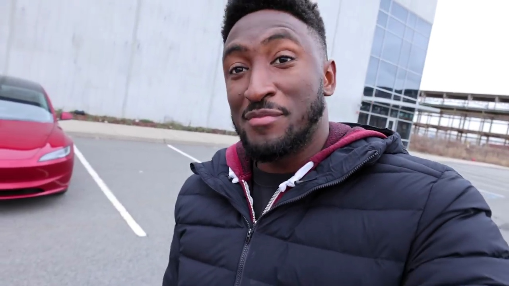
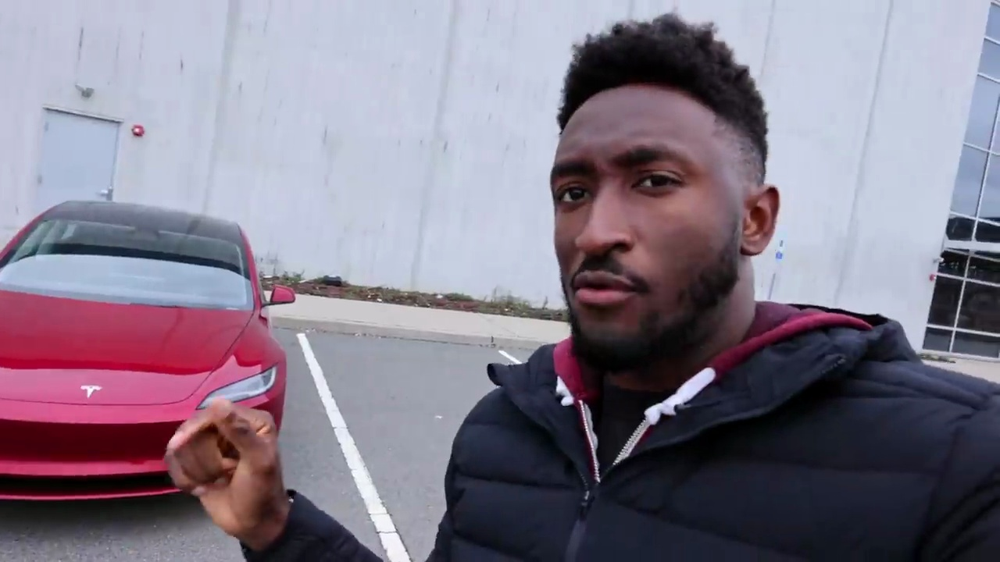
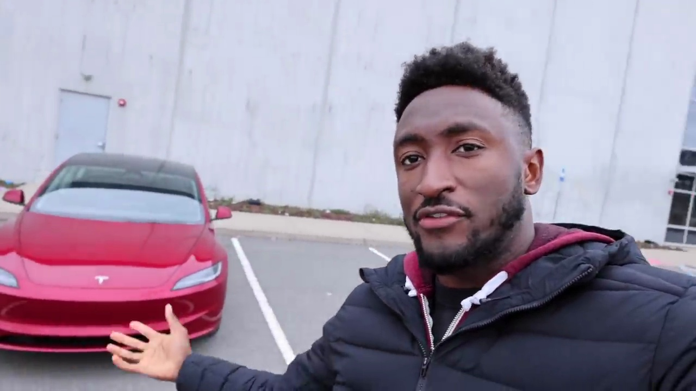

#Tesla Model 3 2024 Refresh Review

### First Impressions

I'm very impressed with this car, the Tesla Model 3 2024 refresh. Although some people are calling it the "Highland", that's not actually in the name. I've only been testing it for a week, but I've noticed a lot of little differences from the already popular Model 3.

### Exterior Design

The main way you'll be able to tell this car apart is the new distinctive angular headlights that really stand out. But there's more that's new that adds up to make this feel like a worthy flagship model.

### Interior and Features

While the Model S is Tesla's higher-end offering with the performance Plaid variant, this Model 3 could be argued as their most important car. It's the one people will see and know as a Tesla most often, along with the Model Y. This refresh makes the Model 3 feel like a mini Model S in many ways.

### Overall Impression

There are a lot of little things that are new and different about this 2024 Model 3 refresh. The updates make it feel more premium and flagship-worthy, despite being Tesla's mainstream model. The exterior design changes like the headlights are the most obvious, but there are improvements throughout that add up to make this a compelling update to Tesla's popular sedan.