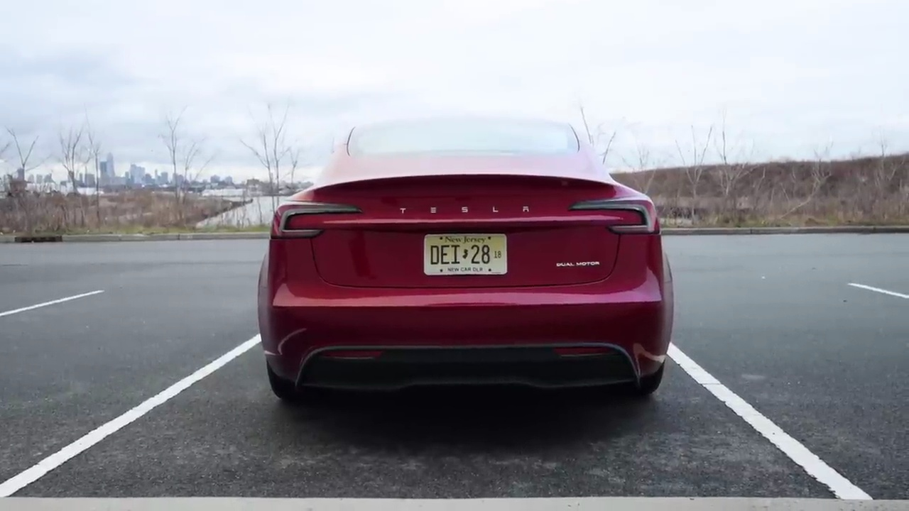

#Tesla Model 3 Refresh Review

###Exterior Design Updates

The refreshed Tesla Model 3 features several exterior design updates that enhance its aerodynamics and styling. One of the most noticeable changes is the new sleek and slim headlights, which give the car a more modern and distinctive look. Additionally, Tesla has introduced a new Ultra Red paint color, which looks stunning and vibrant, especially when captured by high-quality cameras like the Canon R5.

The front of the car has been redesigned with a slightly lower nose, contributing to improved aerodynamics and better range. The drag coefficient has been officially reduced to 0.219, primarily due to the optimized front design and areas that encounter the most air resistance.

While the side profile remains largely unchanged, the rear of the car showcases new angular taillights that are now a single, uninterrupted piece across the trunk. This design element creates a continuous light effect at night, adding to the car's modern aesthetic.

###Branding and Badging

One notable change is the removal of the Tesla logo from the rear of the car. Instead, the word "Tesla" is now displayed in text form. While this design choice may take some getting used to, it contributes to the car's clean and minimalistic look. The only remaining Tesla logo is now located on the front hood.

###Performance and Range

Despite the visual updates, the refreshed Model 3 retains its impressive performance and range capabilities. The narrator mentions averaging well under 300 watt-hours per mile and achieving a range of 330 miles on a full charge, even in cold weather conditions. However, it's important to note that Tesla's range estimates tend to be slightly optimistic, and real-world range may be closer to 290-285 miles.

###Interior and Trunk Space

While the transcript doesn't delve into interior details, it does mention the power liftgate and decent-sized trunk space, which remain unchanged from the previous Model 3 design.

Overall, the Tesla Model 3 refresh brings a fresh and modern look to the popular electric vehicle, while maintaining its impressive performance and range capabilities. The design updates, particularly the new headlights, taillights, and paint color options, contribute to the car's sleek and aerodynamic appearance, making it a compelling choice for those seeking a stylish and efficient electric vehicle.