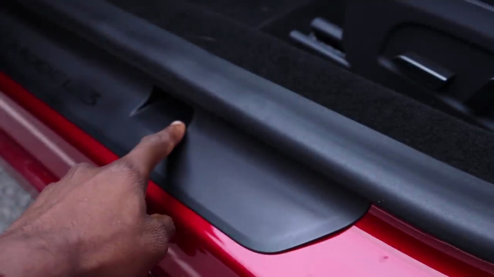

###### Exploring the Tesla's Improved Interior Quality

The narrator starts by highlighting the subtle yet significant improvements in the Tesla's interior quality, materials, and overall driving comfort. He then focuses on the door, which serves as the first point of interaction with the car.

### Door Sealing and Noise Reduction
One notable enhancement is the improved door sealing mechanism, similar to those found in German luxury cars. The narrator points out a small notch and a part that plugs into the door, creating a better seal around the entire cabin. This improved sealing results in a quieter driving experience, reducing exterior noise intrusion even when entering the vehicle.

The narrator demonstrates the quieter door closing, emphasizing the enhanced cabin insulation and overall refinement.