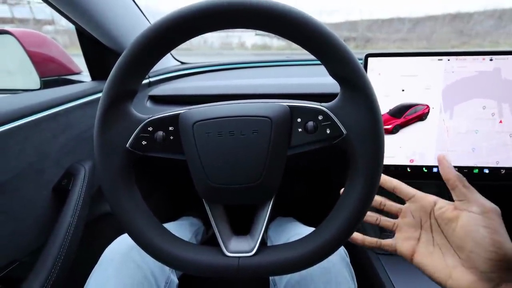
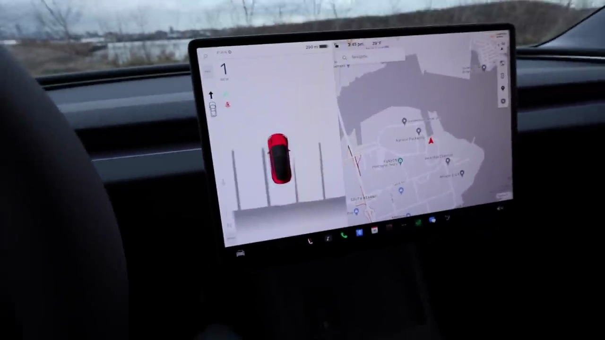

###### Reviewing the Tesla Model 3 Interior Refresh

The refreshed Tesla Model 3 interior feels more premium and luxurious, while still retaining its recognizable minimalist design. The new steering wheel is a standout feature, with no stalks for turn signals or gear selection. Instead, you use buttons on the steering wheel for these functions.

### The New Steering Wheel

- Right side buttons: windshield wipers, voice dictation, autopilot activation, and following distance adjustment
- Left side buttons: turn signals, high beams, media controls, and volume
- Center: regular horn (no buttons)
- Close to circular shape, may take some getting used to

### Improved Materials and Build Quality

- Alcantara trim on the doors and dash feels soft and premium
- Fabric accents around the vents and upper dash add a unique look
- Continuous LED light strip around the interior provides ambient lighting with customizable colors

### Faster Infotainment System

The new center screen has a faster computer, making the software more responsive than ever. Tesla's infotainment system remains one of the best in the industry.

### High Fidelity Park Assist

The new parking assist system provides a detailed view of the car's surroundings, including parking lines and a heat map showing proximity to objects. It's not a 360-degree camera, but it's a significant improvement over the previous system.

### Improved Seats

The front seats have been updated with softer, more comfortable materials, adding to the overall premium feel of the interior.

While some changes, like the lack of stalks, may take some getting used to, the refreshed Model 3 interior feels like a step towards a more luxurious and comfortable driving experience, while still maintaining Tesla's signature minimalist aesthetic.