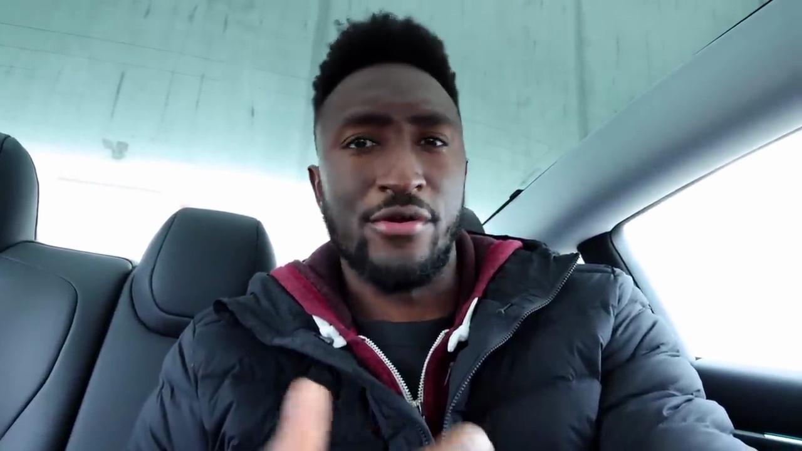
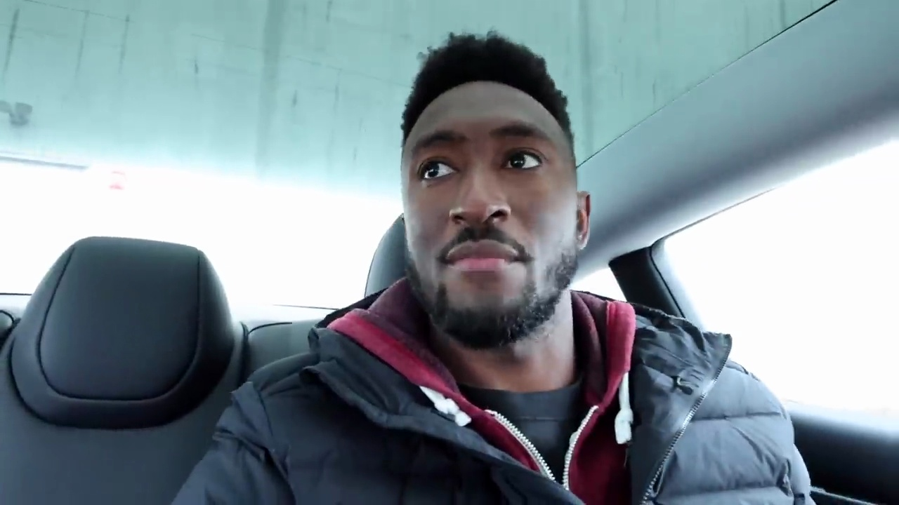

###### Exploring the Backseat of the Tesla Model 3

The backseat of the Tesla Model 3 offers a decent amount of space, though not overly spacious for taller passengers. The floor is flat through the middle, providing some legroom. However, the standout feature is the flush touchscreen integrated into the back of the front seats. With thin bezels, this screen allows backseat passengers to control airflow, HVAC, and even access some media functions.

### Enhanced Backseat Experience

According to the narrator, this backseat touchscreen significantly improves the experience for rear passengers compared to regular Model 3s without this feature. The heated backseats and LED lighting further contribute to the comfort and ambiance.

While the glass roof doesn't offer the uninterrupted view of the Model S and X, it still provides ample headroom and an open, airy feel. Overall, the combination of features like the touchscreen, heated seats, and panoramic glass roof elevates the backseat experience in the Model 3.