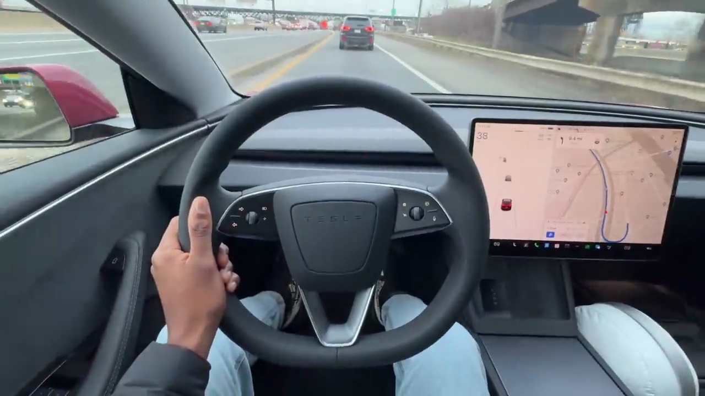
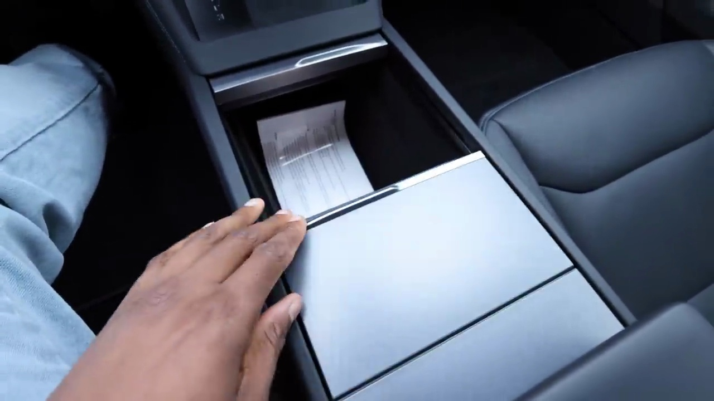

###### Driving Experience Improvements

The Tesla Model 3 has received significant upgrades that enhance the driving experience. One notable improvement is the quieter cabin acoustics, providing a more serene environment while driving. Additionally, the suspension has been softened, resulting in a noticeably more comfortable ride. While this may come at the expense of a slightly less sporty feel, it addresses the firmness that some owners found excessive in the previous coil suspension setup.

Another welcome change is the tighter steering radius, which was not heavily advertised but adds to the overall driving dynamics. The improved speaker system also contributes to an elevated audio experience within the quieter cabin.

### Interior Refinements

The interior of the updated Model 3 now feels more akin to a miniature Model S. Familiar features like the wireless charger, key card, and the sizable center console storage with dual cup holders remain intact. However, the center console no longer moves as it does in the Model S.

Overall, the updates to the Tesla Model 3 have addressed some of the previous model's shortcomings, resulting in a more refined and comfortable driving experience while retaining the core elements that made the vehicle appealing in the first place.