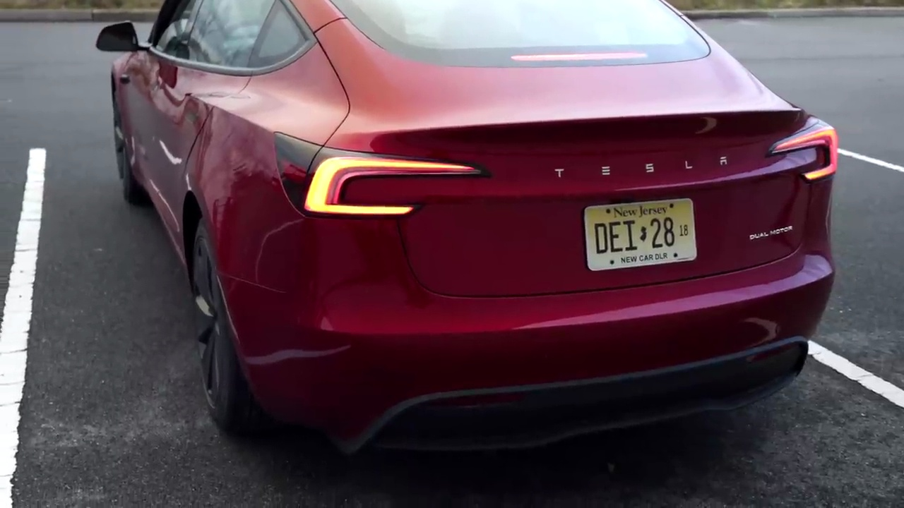

#Tesla Model 3 Review

###Exterior Design

The new Tesla Model 3 has a sleek and refined exterior design. The red color looks stunning, and the overall build quality is impressive. The rear end features the iconic Tesla branding and taillights, giving it a distinctive look.

###Interior and Features
The interior of the Model 3 is well-designed and spacious. It retains the front trunk space and rear trunk space that Tesla owners are accustomed to. One notable improvement is the camera quality, which provides a high-fidelity view of the surroundings, even capturing raindrops clearly when driving.

###Performance
While this is not the performance version of the Model 3, the acceleration and overall quickness are impressive for a non-performance electric vehicle. The narrator mentions that he will try to find official 0-60 mph and horsepower numbers, but he is clearly impressed with the car's responsiveness and power delivery.

###Driving Experience
The Model 3 excels in street driving conditions. The narrator praises its refinement and overall driving experience, stating that it's a "flagship" and a "mini Model S." The suspension setup is well-suited for daily driving, providing a comfortable ride.

###Recommendation
The narrator highly recommends the new Tesla Model 3 to anyone looking for their first electric vehicle. He considers it a complete package, offering a great combination of range, charging network, performance, and overall refinement.

###Final Thoughts
Overall, the new Tesla Model 3 seems to be a compelling option in the electric vehicle market. With its sleek design, impressive performance, and practical features, it could be an excellent choice for those seeking an enjoyable and eco-friendly driving experience.