## [1 Intro](https://www.youtube.com/watch?v=iueGI4CzP-0&t=0s)

### Impressive First Impressions

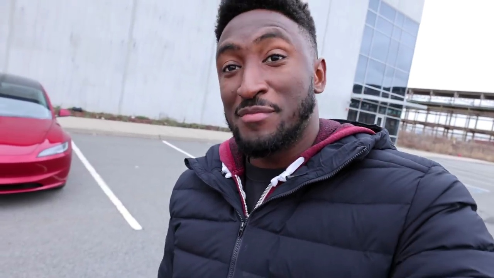

<a href="https://www.youtube.com/watch?v=iueGI4CzP-0&t=15s">Link to video</a>

I'm very impressed with this car, the Tesla Model 3 2024 refresh. Although many are calling it the "Highland," that's not actually in the name. After testing it for a week, I've noticed several new features that make it feel like a worthy flagship model.

### Distinctive Design Updates

The main way to distinguish this refreshed Model 3 from the current version is the new distinctive angular headlights that point directly at you. However, there are many other updates that collectively elevate this car to a new level.

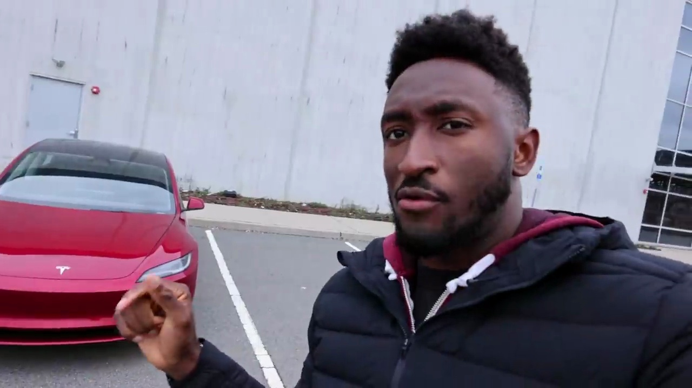

<a href="https://www.youtube.com/watch?v=iueGI4CzP-0&t=30s">Link to video</a>

### A Mini Model S

While the Model S remains Tesla's higher-end offering with the Plaid variant and performance features, the Model 3 is their most important and visible car. This refresh makes the Model 3 feel like a mini Model S, solidifying its position as Tesla's flagship model for the masses.

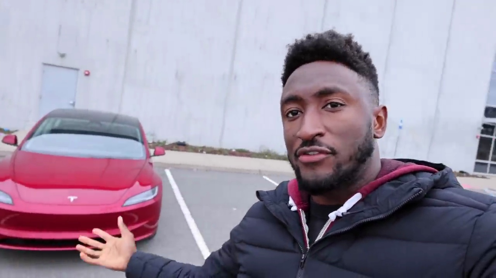

<a href="https://www.youtube.com/watch?v=iueGI4CzP-0&t=45s">Link to video</a>

### A Worthy Upgrade

With its updated design, new features, and elevated overall experience, the 2024 Tesla Model 3 refresh seems like a worthy upgrade and a true flagship model for the brand. It's the car that will likely define Tesla's image for most consumers, and it appears to be up to the task.
## [2 Exterior](https://www.youtube.com/watch?v=iueGI4CzP-0&t=58s)

### Sleek and Aerodynamic Styling

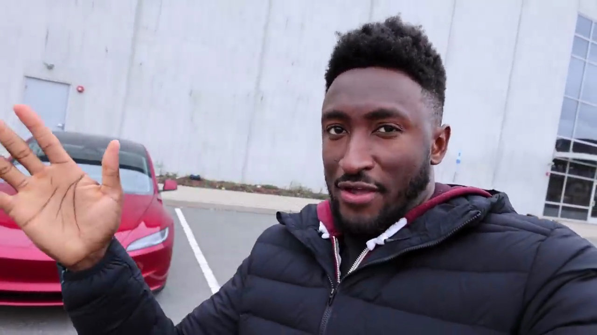

<a href="https://www.youtube.com/watch?v=iueGI4CzP-0&t=58s">Link to video</a>

The new Tesla Model 3 features sleek and slim headlights that give it a distinctive look. The front end has a slightly more aerodynamic slope, contributing to a lower drag coefficient of 0.219. This improved aerodynamics helps increase the range of the vehicle.

### Ultra Red Paint Color

The car showcased here is painted in a new color option called Ultra Red. The narrator appreciates how the camera captures the vibrant hue of this paint job. Tesla also offers a Stealth Gray color, but the Ultra Red is the one highlighted.

### Wheels and Side Profile

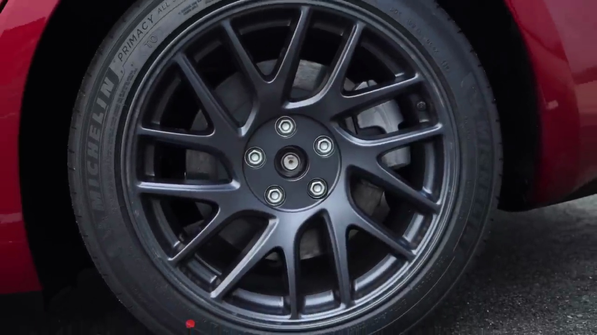

<a href="https://www.youtube.com/watch?v=iueGI4CzP-0&t=136s">Link to video</a>

From the side, the Model 3 retains its familiar silhouette, with slightly updated wheel designs being the only noticeable change. The angular rear taillights are a distinctive new feature, forming a continuous uninterrupted light bar across the trunk lid.

### Rear Design and Badging

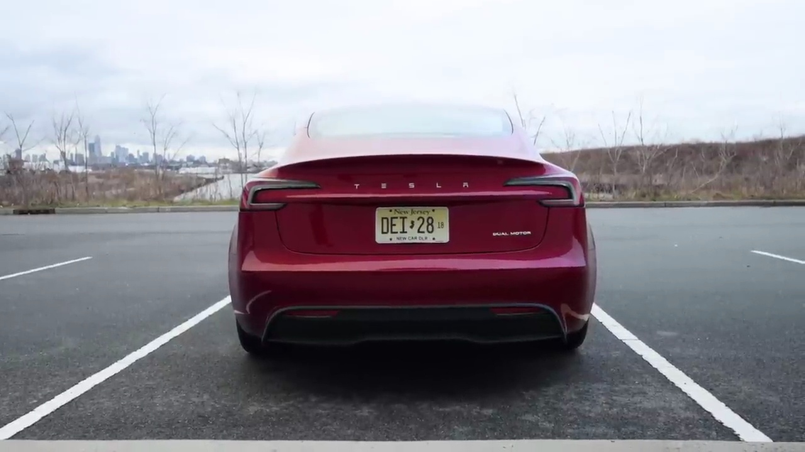

<a href="https://www.youtube.com/watch?v=iueGI4CzP-0&t=188s">Link to video</a>

At the rear, the new Model 3 features a clean design with the "Tesla" name spelled out in text instead of the traditional logo badging. The only Tesla logo is now located on the front hood. The power liftgate and trunk space remain unchanged from previous models.

### Range and Efficiency

Despite the design updates, the new Model 3 maintains impressive range and efficiency. The narrator reports averaging well under 300 watt-hours per mile and achieving around 290-285 miles of real-world range on a full charge, even in cold weather conditions.

Overall, the exterior design updates to the Tesla Model 3 bring a fresh and aerodynamic look while retaining the core styling and practicality that made the original model popular.
## [3 Interior](https://www.youtube.com/watch?v=iueGI4CzP-0&t=192s)

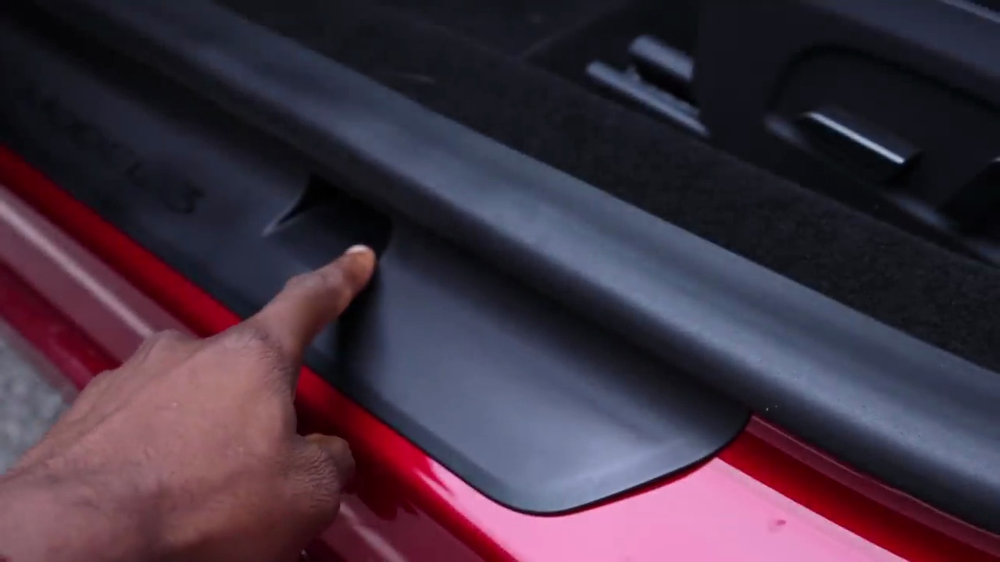

<a href="https://www.youtube.com/watch?v=iueGI4CzP-0&t=222s">Link to video</a>

The new Tesla model features improved door sealing, with a better seal around the entire door frame. This enhancement provides a quieter cabin experience when driving and even when entering or exiting the vehicle. The door handle remains the same, but there is a noticeable difference in the way the door seals against the body.

One notable change is the addition of a small notch or plug that fits into the door, similar to what is seen in German cars. This design element contributes to the improved sealing and noise reduction.

When closing the door, the tighter seal is immediately apparent, creating a more insulated and comfortable interior environment.
## [4 Driving](https://www.youtube.com/watch?v=iueGI4CzP-0&t=237s)

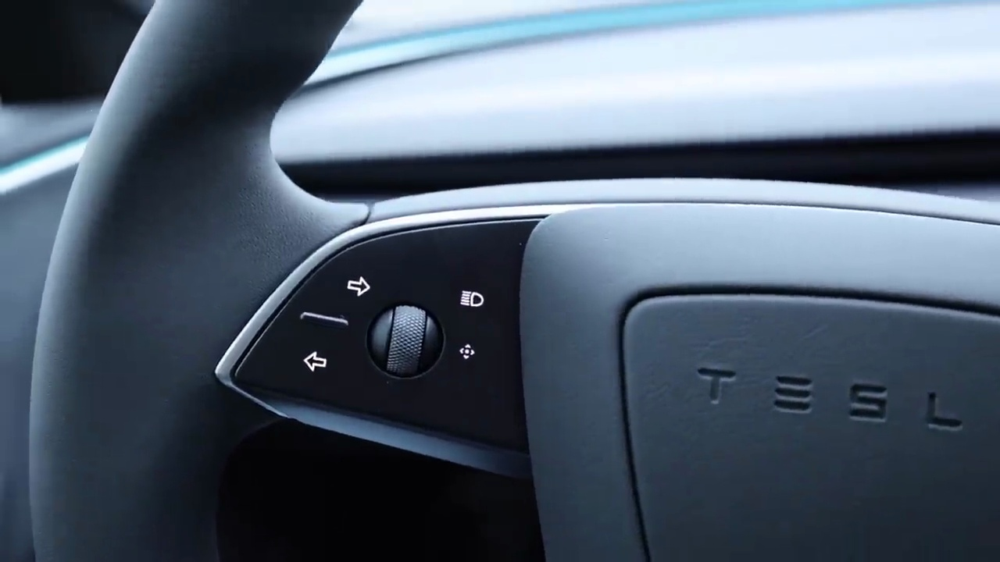

<a href="https://www.youtube.com/watch?v=iueGI4CzP-0&t=323s">Link to video</a>

The new Tesla Model 3 interior features a redesigned steering wheel without stalks. The blinkers and gear selection are now controlled by buttons and swipes on the steering wheel itself. While this may take some getting used to, it aligns with the minimalist design philosophy of the Model S.

### Premium Materials and Lighting

The interior boasts improved materials and build quality, with soft Alcantara accents and a unique fabric trim around the air vents. One standout feature is the continuous LED lighting strip that runs around the entire cabin, allowing you to change the color and ambiance.

### Responsive Touchscreen and Parking Assist

The center touchscreen now has a faster computer, making the software and interface more responsive than ever. The new High Fidelity Park Assist provides a detailed view of the surroundings, displaying parking lines and a heat map indicating proximity to obstacles.

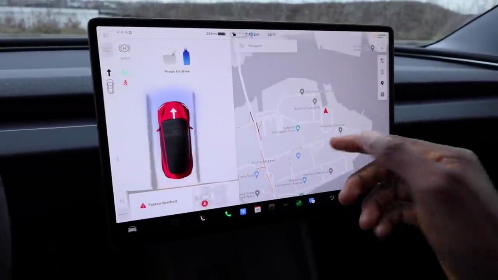

<a href="https://www.youtube.com/watch?v=iueGI4CzP-0&t=409s">Link to video</a>

### Comfortable Seating

The front seats have been upgraded to offer a softer and more comfortable experience, further enhancing the premium feel of the interior.

Overall, the new Tesla Model 3 interior strikes a balance between luxury and minimalism, with thoughtful design touches and improved technology that elevate the driving experience.
## [5 Backseats](https://www.youtube.com/watch?v=iueGI4CzP-0&t=453s)

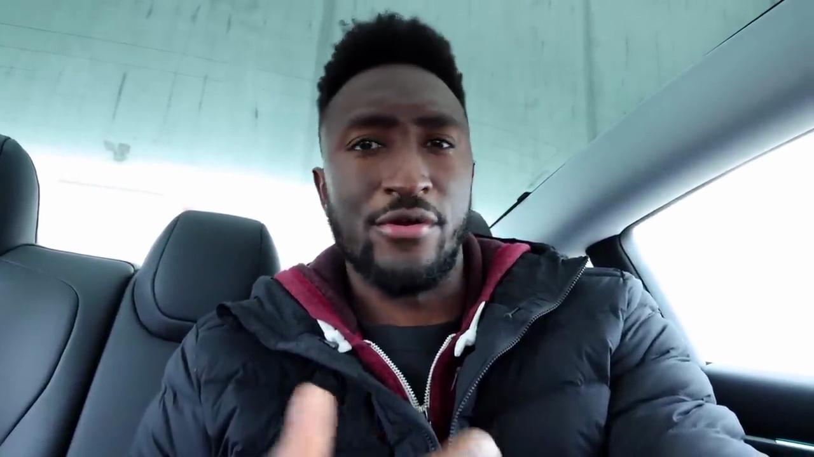

<a href="https://www.youtube.com/watch?v=iueGI4CzP-0&t=498s">Link to video</a>

The backseat of the Tesla Model 3 offers a decent amount of space, though not overly spacious for taller passengers. The floor is flat through the middle, providing some legroom. However, the standout feature is the flush touchscreen integrated into the back of the front seats. With thin bezels, this screen allows backseat passengers to control airflow, HVAC, and even access some media functions, significantly enhancing the rear passenger experience.

### Backseat Amenities

The Model 3's backseat also features:

- Heated seats for added comfort

- LED lighting overhead

- Panoramic glass roof, providing ample headroom and an open, airy feel (though not the uninterrupted glass found in the Model S and X)

Overall, the combination of the touchscreen, heated seats, and glass roof elevates the backseat experience in the Model 3, making it a more enjoyable ride for rear passengers compared to many other vehicles in its class.
## [6 Drivers Seat](https://www.youtube.com/watch?v=iueGI4CzP-0&t=515s)

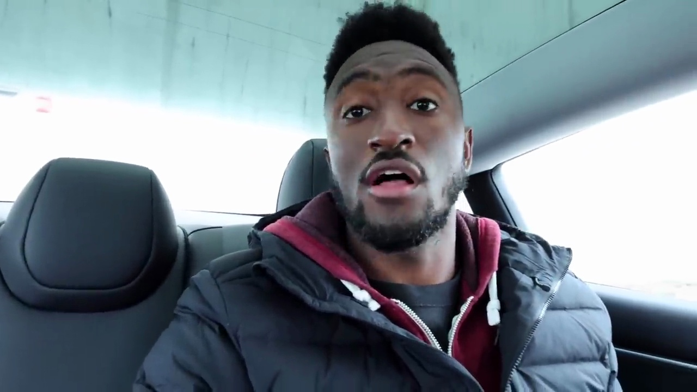

<a href="https://www.youtube.com/watch?v=iueGI4CzP-0&t=515s">Link to video</a>

The new Model 3 has significantly improved cabin acoustics, making it much quieter while driving, which is awesome. Additionally, it features a noticeably softer suspension compared to the previous coil suspension, providing a more comfortable ride. Although this comes at the expense of a slightly less sporty feeling, many owners would agree that the old Model 3's suspension was a bit too firm at times.

###### Enhanced Steering and Audio System

The updated Model 3 also boasts a tighter steering radius, which is a cool improvement that wasn't heavily advertised. Furthermore, the speaker system has been greatly improved, allowing for a better audio experience in the quieter cabin while driving.

###### Familiar Features and Storage

Despite the upgrades, the Model 3 retains some of its signature features that fans have grown accustomed to, such as the wireless charger, key fob card, and the spacious center console storage with two cup holders that can be easily opened and closed.

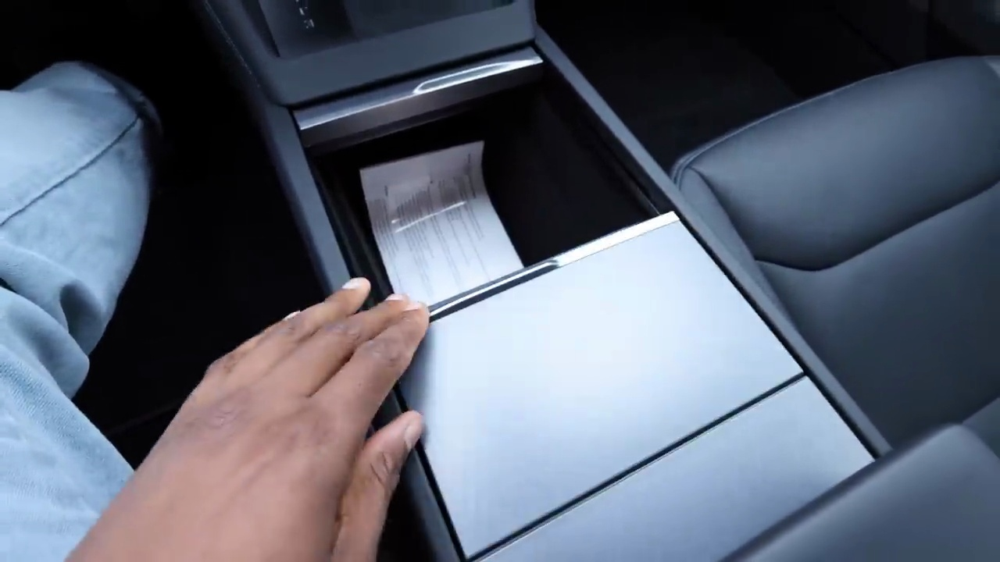

<a href="https://www.youtube.com/watch?v=iueGI4CzP-0&t=605s">Link to video</a>

Overall, the new Model 3 feels like a mini Model S, offering a more refined and comfortable driving experience while maintaining the familiar elements that have made it a popular choice among electric vehicle enthusiasts.