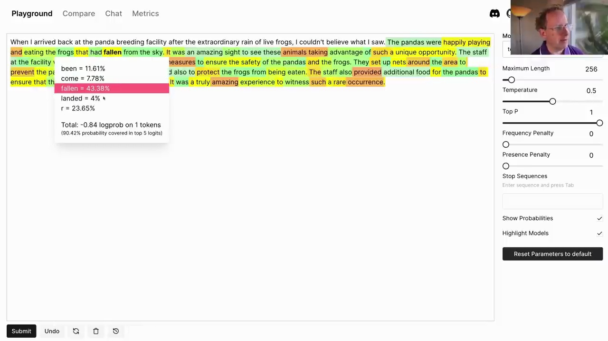
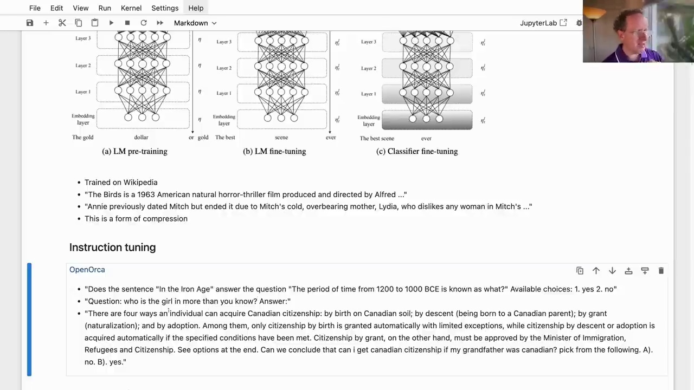

#  A Hacker's Guide to Language Models

### What is a Language Model?

A language model is a system that can predict the next word in a sentence or fill in missing words. It is trained on a large corpus of text, such as Wikipedia or the internet, to learn patterns and relationships between words. The goal is to build a rich understanding of language, concepts, and the world in general, enabling it to make intelligent predictions.

To illustrate, let's consider the OpenAI language model text-davinci-003. We can provide it with a prompt like "When I arrived back at the panda breeding facility after the extraordinary rain of live frogs, I couldn't believe what I saw." The model might continue with:



The model has learned that pandas eat frogs, and it can generate a plausible continuation of the story based on its understanding of the world.

### Tokenization

Language models don't operate on whole words but rather on tokens, which can be words, subword units, punctuation, or numbers. For example, the sentence "They are splashing" is tokenized as:

```
[2990, 389, 4328, 2140]
```

These numbers represent lookups in the model's vocabulary. We can decode them back to the original tokens:

```python
[enc.decode_single_token_bytes(o).decode('utf-8') for o in toks]
['They', ' are', ' spl', 'ashing']
```

### The ULMFiT 3-Step Approach


The ULMFiT approach, introduced in 2017, consists of three steps:

1. **Language Model Pre-training**: A neural network is trained on a large corpus to predict the next word in a sentence. This allows the model to learn rich representations and acquire knowledge about the world.

2. **Language Model Fine-tuning**: The pre-trained model is fine-tuned on a dataset more closely related to the target task, such as answering questions or following instructions.

3. **Classifier Fine-tuning**: The fine-tuned model is further trained using techniques like reinforcement learning from human feedback to optimize for the specific end task.

### Instruction Tuning



In the language model fine-tuning step, a technique called instruction tuning is often used. The model is trained on datasets like OpenAlca, which contain questions, instructions, and their corresponding responses. This helps the model learn to follow instructions and answer questions more effectively.

```
OpenOrca

• "Does the sentence "In the Iron Age" answer the question "The period of time from 1200 to 1000 BCE is known as what?" Available choices: 1. yes 2. no"

• "Question: who is the girl in more than you know? Answer: ..."

• "There are four ways an individual can acquire Canadian citizenship: by birth on Canadian soil; by descent (being born to a Canadian parent); by grant
(naturalization); and by adoption. Among them, only citizenship by birth is granted automatically with limited exceptions, while citizenship by descent or adoption is
acquired automatically if the specified conditions have been met. Citizenship by grant, on the other hand, must be approved by the Minister of Immigration,
Refugees and Citizenship. See options at the end. Can we conclude that can i get canadian citizenship if my grandfather was canadian? pick from the following. A).
no. B). yes."
```

### Code Examples

```python
[3]: [2990, 389, 4328, 2140]

[1]: [enc.decode_single_token_bytes(o).decode('utf-8') for o in toks]
['They', ' are', ' spl', 'ashing']
```

This code demonstrates tokenization and decoding of tokens using the `tiktoken` library and the `text-davinci-003` encoding.

Overall, this guide provides a code-first approach to understanding language models, their training process, and their applications in tasks like question answering and instruction following.