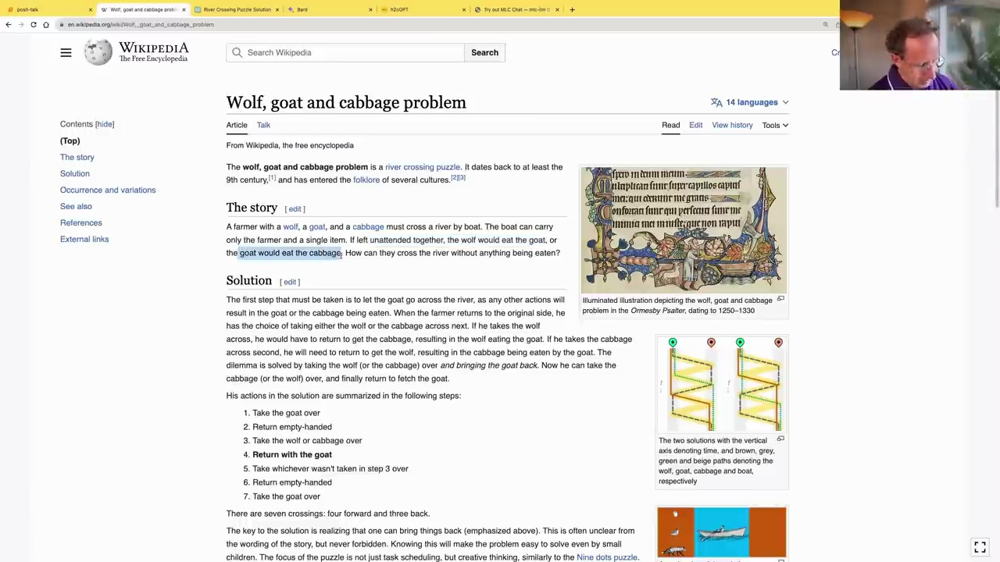
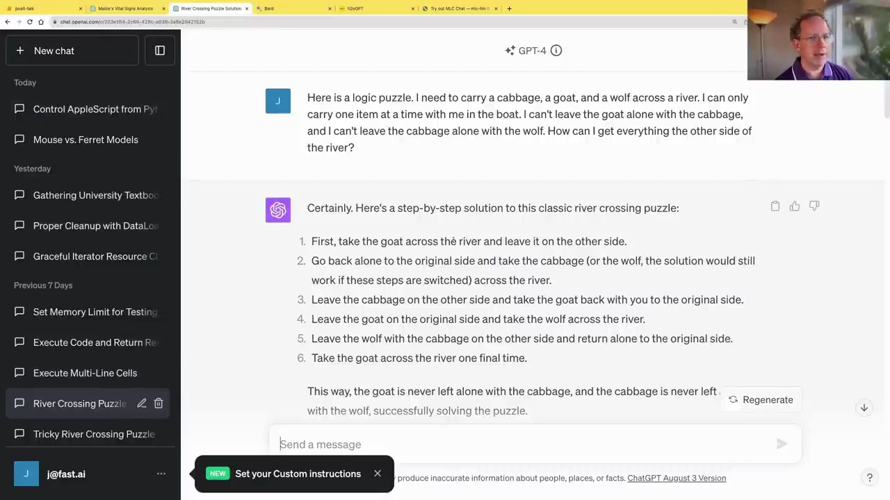

#  River Crossing Puzzle

## The Classic Puzzle

The classic river crossing puzzle is a logic problem that dates back to at least the 9th century. It has entered the folklore of several cultures. The story goes like this:

A farmer needs to transport a wolf, a goat, and a cabbage across a river by boat. The boat can only carry the farmer and one item at a time. If left unattended, the wolf would eat the goat, or the goat would eat the cabbage.



The solution involves a series of carefully planned crossings, ensuring that the wolf and the goat are never left alone, and the goat and the cabbage are never left alone. The key steps are:

1. Take the goat across the river
2. Return empty-handed
3. Take the wolf or the cabbage across
4. Return with the goat
5. Take whichever wasn't taken in step 3 across
6. Return empty-handed
7. Take the goat across

This way, the goat is never left alone with the cabbage, and the cabbage is never left alone with the wolf, successfully solving the puzzle.

## A Tricky Variation

Steve Newman presented a variation of the puzzle, where the constraints are slightly different:

> Here is a logic puzzle. I need to carry a cabbage, a goat, and a wolf across a river. I can only carry one item at a time with me in the boat. I can't leave the goat alone with the cabbage, and I can't leave the cabbage alone with the wolf. How can I get everything to the other side of the river?

In this version, the goat would eat the cabbage, and the wolf would eat the cabbage, but the wolf won't eat the goat.



Initially, GPT-4 struggles with this variation, as it has been heavily primed by the classic version of the puzzle. It attempts to solve it using the familiar pattern, which violates the new constraints.

However, after multiple attempts and explicit clarification of the constraints, GPT-4 is able to solve the puzzle correctly:

```
1. First, take the cabbage across the river and leave it on the other side.
2. Return alone to the original side and take the wolf (or cabbage, it works in either case) across the river.
3. Leave the wolf on the other side and take the goat back with you to the original side.
4. Leave the goat on the original side and take the cabbage across the river.
5. Leave the cabbage with the wolf on the other side and return alone to the original side.
6. Take the goat across the river one final time.
```

This solution ensures that the goat is never left alone with the cabbage, and the cabbage is never left alone with the wolf, successfully solving the puzzle without violating any constraints.

## Overcoming Priming and Hallucination

The river crossing puzzle demonstrates how language models like GPT-4 can struggle with variations of well-known problems due to priming and hallucination. Priming refers to the model's tendency to continue patterns it has seen repeatedly during training, even when the context has changed. Hallucination is the model's inclination to generate plausible-sounding but incorrect responses when it lacks specific knowledge.

To overcome these challenges, it is essential to provide clear instructions, explicit constraints, and engage in multi-turn conversations with the model. By guiding the model through the problem-solving process, clarifying misunderstandings, and encouraging it to re-evaluate its assumptions, it is possible to steer the model towards the correct solution.

This exercise highlights the importance of careful prompting, iterative refinement, and a deep understanding of the model's capabilities and limitations when working with language models on complex reasoning tasks.

### What GPT-4 Can't Do

While GPT-4 demonstrates impressive reasoning abilities, it is essential to understand its limitations. Some key limitations include:

- **Hallucinations**: GPT-4 can generate plausible-sounding but incorrect information, especially when prompted about topics it has limited knowledge of.
- **Self-awareness**: GPT-4 does not have a comprehensive understanding of its own architecture, training process, or capabilities.
- **Knowledge cutoff**: GPT-4's knowledge is limited to the training data, which has a cutoff date of September 2021. It cannot provide information about events or developments after that date.
- **URL and website understanding**: GPT-4 has limited ability to interpret URLs or understand the content of specific websites.

By acknowledging these limitations and providing appropriate guidance, users can leverage GPT-4's strengths while mitigating its weaknesses, leading to more effective and reliable results.

## Conclusion

The river crossing puzzle and its variations showcase the impressive reasoning capabilities of language models like GPT-4, as well as their potential pitfalls. By carefully crafting prompts, engaging in multi-turn conversations, and providing explicit constraints, users can guide the model towards accurate solutions, even for challenging problems. However, it is crucial to understand the model's limitations, such as hallucinations, lack of self-awareness, and knowledge cutoff dates, to ensure responsible and effective use of these powerful language models.