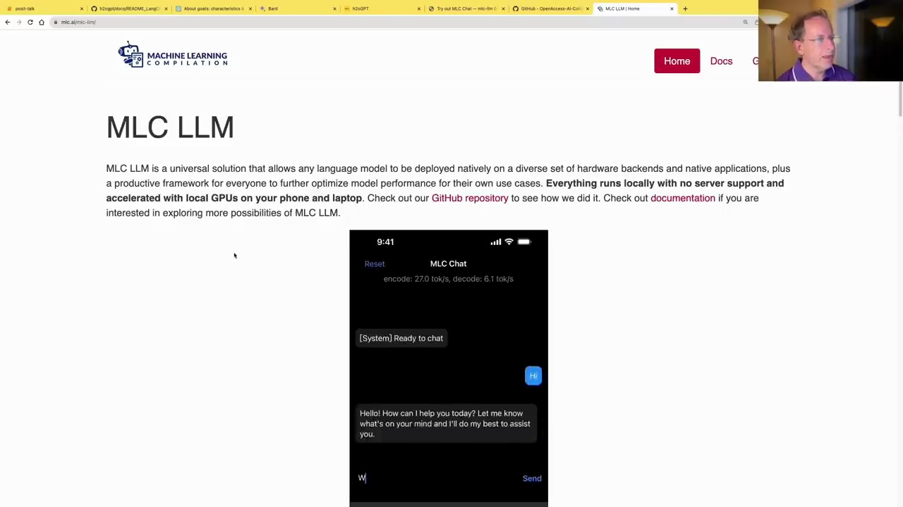

#  MLC LLM: Running Language Models on Mobile Devices

### MLC LLM: A Universal Solution

MLC LLM is a universal solution that allows any language model to be deployed natively on a diverse set of hardware backends and native applications, plus a productive framework for everyone to further optimize model performance for their own use cases. Everything runs locally with no server support and accelerated with local GPUs on your phone and laptop.



MLC LLM provides a way to run language models on mobile devices like iPhones and Android phones, as well as web browsers. It's a really cool project that is underappreciated.

### Running a Language Model on a Mac

On a Mac, you can use MLC or llama.cpp to run language models. Here's an example of running a 7B language model on a Mac using a Python script:

```python
from llama_cpp import Llama

llm = Llama(model_path="/home/jhoward/git/llamacpp/llama-2-7b-chat.04_K.M.gguf")
```

This loads a 7B language model from the specified path. You can then use the model to generate text or answer questions.


```python
res = model.generate(**toks.to("cuda"), max_new_tokens=250).to('cpu')
print(tokr.batch_decode(res)[0])
```

This generates a response from the language model based on the given input tokens, using the GPU for acceleration. The output is then printed.

### Example: Asking the Meaning of Life

With the language model loaded, you can ask it questions like "What is the meaning of life?". The model will generate a response based on its training data and knowledge.

Overall, MLC LLM provides a powerful way to run large language models on local devices, enabling new applications and use cases for natural language processing.