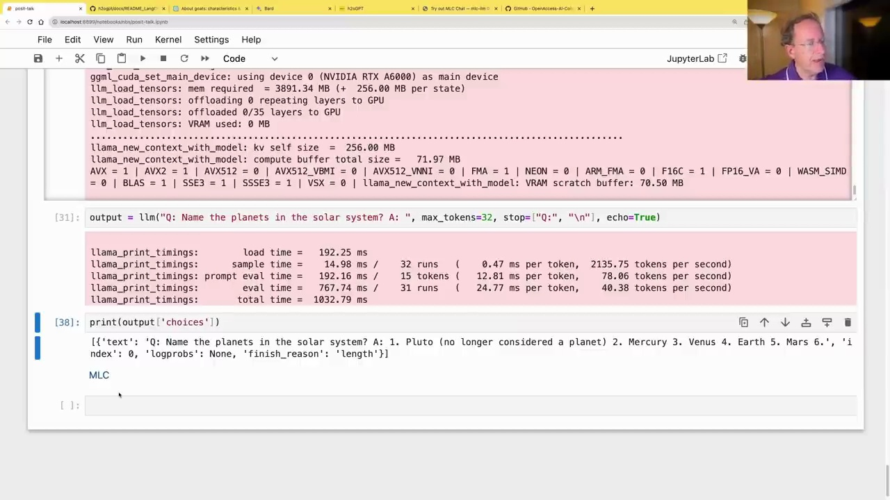

#  Using Language Models with Python

### Exploring Language Model Options

There are several options available for running language models using Python. One popular choice is to use PyTorch and the Hugging Face ecosystem, especially if you have an Nvidia graphics card and are comfortable with Python programming.



Another option is llama.cpp, which can run on various platforms, including Macs and Cuda. It uses the ggml format, and you can download pre-trained models from Hugging Face. Here's an example of how to use it:

```python
from llama_cpp import Llama

llm = Llama(model_path="/home/jhoward/git/llamacpp/llama-2-7b-chat.ggml")
output = llm("Q: Name the planets in the solar system? A: ", max_tokens=32, stop="\n", echo=True)
print(output['choices'])
```

This will output:

```
[{'text': 'Q: Name the planets in the solar system? A: 1. Pluto (no longer considered a planet) 2. Mercury 3. Venus 4. Earth 5. Mars 6.', 'index': 0, 'logprobs': None, 'finish_reason': 'length'}]
```

### Getting Help and Staying Updated

As language models are rapidly evolving, it's essential to seek help from the community and stay updated with the latest developments. Discord channels, such as the fast.ai Discord server, can be valuable resources for asking questions and sharing insights.


While language models are exciting, it's important to note that they are still in their early stages, and there may be edge cases and installation challenges. However, this is an excellent time to get involved and explore the possibilities of language models, especially if you're comfortable with Python programming.

Overall, language models offer a powerful tool for various applications, and with the right resources and community support, you can embark on an exciting journey of exploration and discovery.