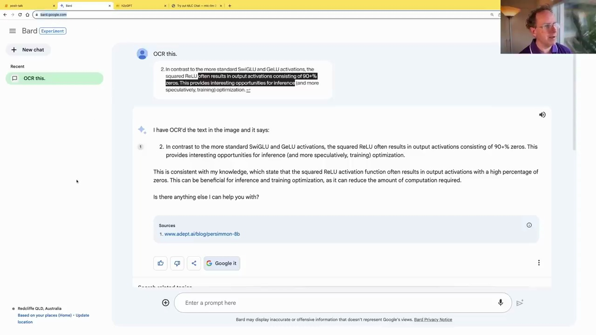
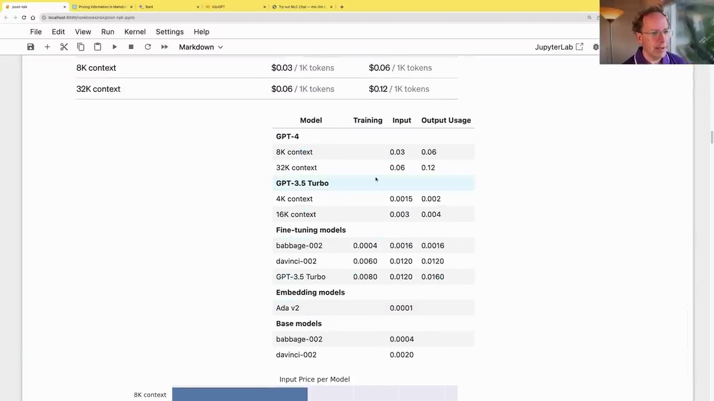
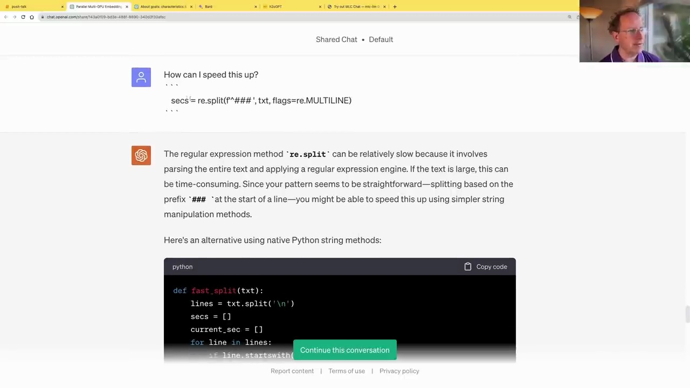

#  Using GPT-4 for Advanced Data Analysis

### OCR with GPT-4

GPT-4 can be used for Optical Character Recognition (OCR) tasks, allowing you to extract text from images. Here's how it works:

1. Upload an image containing text to the chat interface.
2. Ask GPT-4 to extract the text from the image using OCR.



GPT-4 will then utilize OCR technology to extract the text from the image and provide it to you.

### Pricing Information for OpenAI Models

To display pricing information for various OpenAI models in a clear and concise manner, you can ask GPT-4 to create a table or chart from the pricing data on the OpenAI website.



GPT-4 can parse the pricing information from the website and present it in a well-formatted table or chart, making it easier to compare the costs of different models and contexts.

### Code Examples

GPT-4 can also assist with coding tasks, such as optimizing regular expression operations for improved performance.



In this example, GPT-4 provides an alternative implementation using native Python string methods, which can be more efficient than regular expressions for certain patterns.

While GPT-4 can be helpful in generating code snippets and optimizations, it's important to note that it has limitations in terms of reasoning and logic for complex coding tasks that require thinking outside the box.

```python
def fast_split(txt):
    lines = txt.split('\n')
    secs = []
    current_sec = []
    for line in lines:
        if line.startswith('###'):
            if current_sec:
                secs.append('\n'.join(current_sec))
                current_sec = []
        else:
            current_sec.append(line)
    if current_sec:
        secs.append('\n'.join(current_sec))
    return secs
```

This code demonstrates a more efficient implementation for splitting text into sections based on a specific pattern, as suggested by GPT-4.