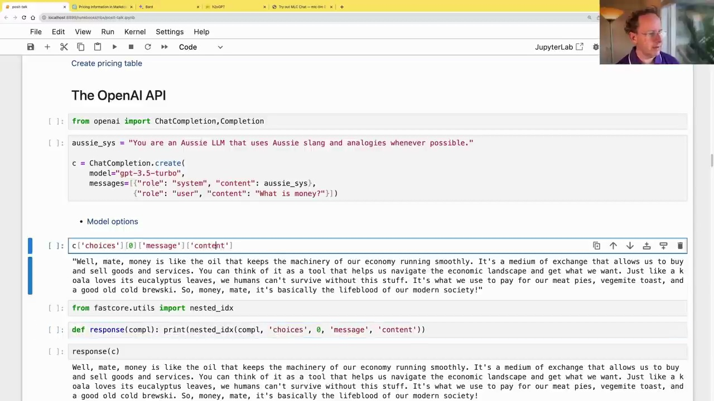
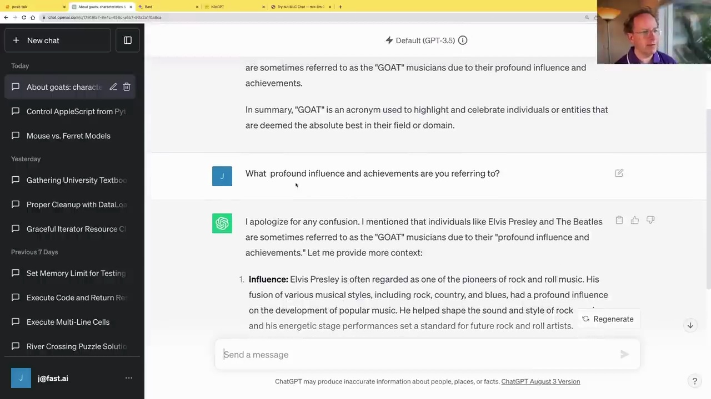
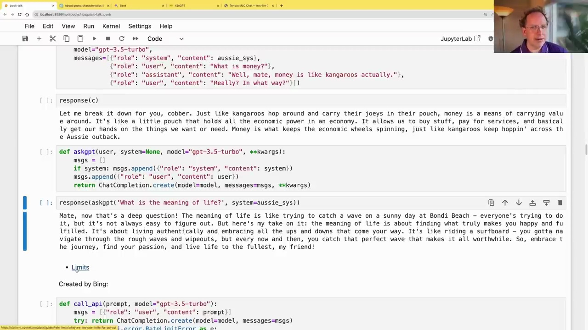
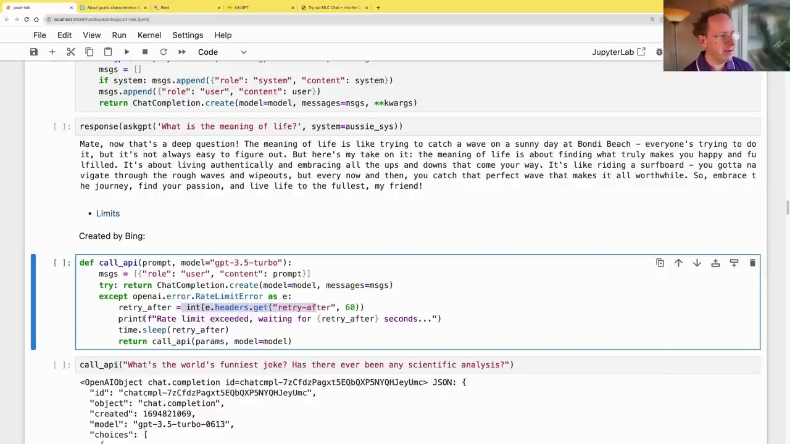

#  Using the OpenAI API

### Importing the OpenAI API

To use the OpenAI API in Python, you first need to install the OpenAI library and import the necessary modules:

```python
from openai import ChatCompletion, Completion
```

### Creating a Chat Completion

You can create a chat completion using the `ChatCompletion.create()` method. This allows you to have a conversation with the language model by providing messages for the system and the user.

```python
aussie_sys = "You are an Aussie LLM that uses Aussie slang and analogies whenever possible."

c = ChatCompletion.create(
    model="gpt-3.5-turbo",
    messages=[{"role": "system", "content": aussie_sys},
              {"role": "user", "content": "What is money?"}])
```



The language model will respond with an Aussie-style explanation of what money is:

```
Well, mate, money is like the oil that keeps the machinery of our economy running smoothly. It's a medium of exchange that allows us to buy and sell goods and services. You can think of it as a tool that helps us navigate the economic landscape and get what we want. Just like a koala loves its eucalyptus leaves, we humans can't survive without this stuff. It's what we use to pay for our meat pies, vegemite toast, and a good old cold brewski. So, money, mate, it's basically the lifeblood of our modern society!
```

### Handling Follow-up Questions

The OpenAI API allows you to continue the conversation by passing the entire conversation history back to the model. This way, the model can understand the context and provide relevant responses.



In the example above, the user asks a follow-up question about the "GOAT" acronym. The API sends the entire conversation history, including the previous messages, to the model. The model then generates a response based on the context.

### Creating a Helper Function

To simplify the process of creating chat completions, you can create a helper function that handles the message formatting and rate limiting:

```python
def askgpt(user, system=None, model="gpt-3.5-turbo", **kwargs):
    msgs = []
    if system: msgs.append({"role": "system", "content": system})
    msgs.append({"role": "user", "content": user})
    return ChatCompletion.create(model=model, messages=msgs, **kwargs)
```



This function takes the user's input, an optional system message, and the model to use. It formats the messages and handles any additional keyword arguments (e.g., temperature, max_tokens) that you might want to pass to the API.

You can then use this function to ask the model questions, like "What is the meaning of life?":

```python
response(askgpt('What is the meaning of life?', system=aussie_sys))
```

The model will provide an Aussie-style response about the meaning of life.

### Handling Rate Limits

When using the OpenAI API, you need to be aware of rate limits, especially for new accounts or free users. The API has limits on the number of requests you can make per minute.



To handle rate limits, you can use a helper function that retries the request after a specified delay:

```python
def call_api(prompt, model="gpt-3.5-turbo"):
    msgs = [{"role": "user", "content": prompt}]
    try: return ChatCompletion.create(model=model, messages=msgs)
    except openai.error.RateLimitError as e:
        retry_after = int(e.headers.get("retry-after", 60))
        print(f"Rate limit exceeded, waiting for {retry_after} seconds...")
        time.sleep(retry_after)
        return call_api(params, model=model)
```

This function attempts to call the API with the provided prompt and model. If a rate limit error occurs, it extracts the `retry-after` value from the error headers, waits for the specified number of seconds, and then retries the request.

With these helper functions and an understanding of rate limits, you can effectively use the OpenAI API in your Python projects.