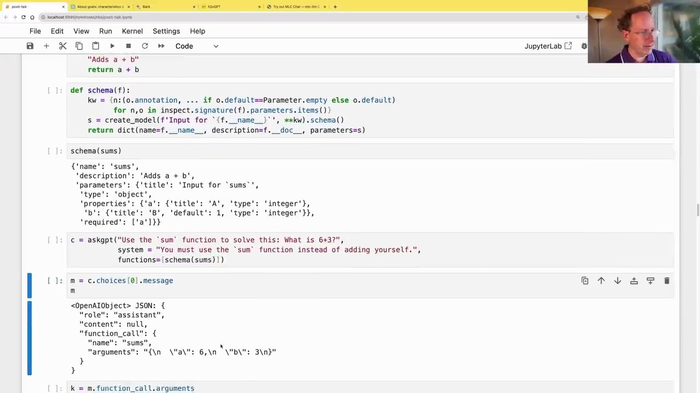
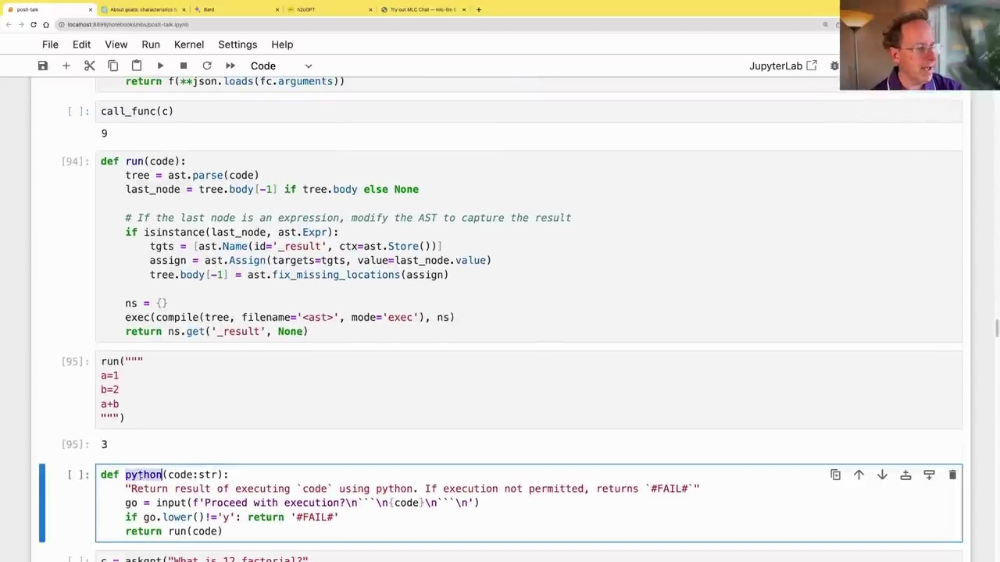
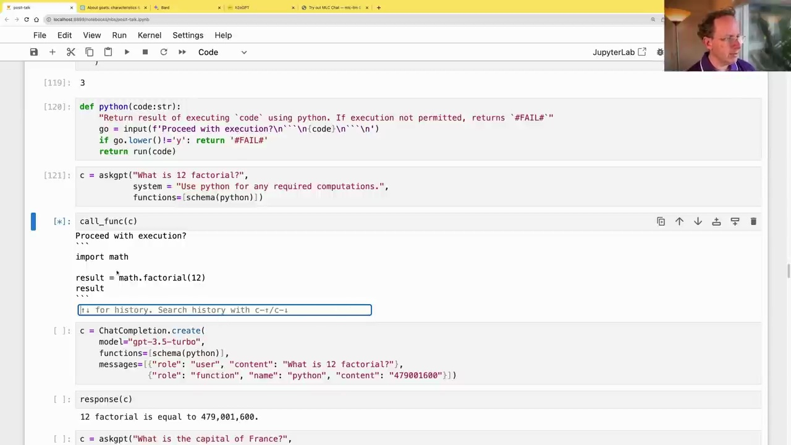

#  Creating a Custom Code Interpreter

### Defining Functions

To create a custom code interpreter, we can leverage the `functions` parameter in the OpenAI API's `chat.completion.create` method. This allows us to define our own functions and pass them to the language model, enabling it to utilize these functions during the conversation.

Here's an example of defining a simple function called `sums` that adds two numbers:

```python
def sums(a: int, b: int=1):
    "Adds a + b"
    return a + b
```

To make this function available to the language model, we need to generate its JSON schema using the `pydantic` and `inspect` libraries:

```python
from pydantic import create_model
import inspect, json
from inspect import Parameter

def schema(f):
    kw = {n:(o.annotation, ... if o.default==Parameter.empty else o.default)
          for n,o in inspect.signature(f).parameters.items()}
    s = create_model(f'Input for `{f.__name__}`', **kw).schema()
    return dict(name=f.__name__, description=f.__doc__, parameters=s)

schema(sums)
```



This schema provides the language model with information about the function's name, description, parameters, and their types.

### Calling Functions

With the function schema defined, we can now pass it to the language model using the `functions` parameter:

```python
c = askgpt("Use the `sum` function to solve this: What is 6+3?",
           system = "You must use the `sum` function instead of adding yourself.",
           functions=schema(sums))
```

The language model will then respond with instructions to call the provided function, including the arguments to pass:



We can then execute the function call and obtain the result:

```python
call_func(c)
# Output: 9
```

### Executing Python Code

We can extend this concept to execute arbitrary Python code by defining a `python` function:

```python
def python(code:str):
    "Return result of executing `code` using python. If execution not permitted, returns `#FAIL#`"
    go = input(f'Proceed with execution?\n``\n{code}\n```\n')
    if go.lower()!='y': return '#FAIL#'
    return run(code)
```

This function prompts for confirmation before executing the provided code using Python's `exec` function.



We can then pass the `python` function's schema to the language model and ask it to perform computations:

```python
c = askgpt("What is 12 factorial?",
           system = "Use python for any required computations.",
           functions=schema(python))

call_func(c)
```

The language model will generate the appropriate Python code, request confirmation, and execute it, returning the result.

By leveraging the `functions` parameter, we can create a custom code interpreter that allows the language model to utilize our defined functions, enabling a wide range of capabilities beyond its initial training.