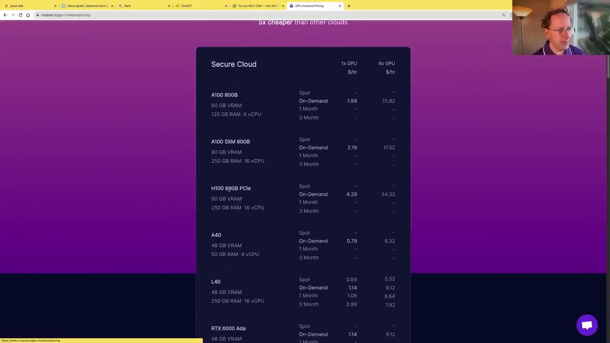
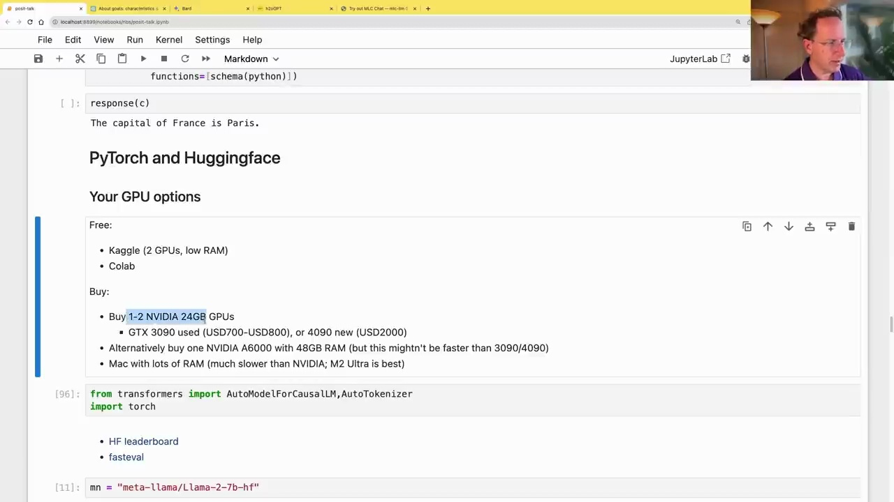

#  GPU Options for Running Language Models

### Renting GPUs

For running language models on GPUs without purchasing hardware, there are several options for renting GPU servers:

- **Kaggle** provides free notebooks with 2 older GPUs and limited RAM.
- **Colab** offers better GPUs and more RAM, especially with a paid subscription.
- **Cloud providers** like Run:ai offer powerful GPU instances, but can be expensive (e.g., $34/hour for high-end options).
- **Lambda Labs** is often a cost-effective option.
- **Fast.ai** allows using idle computing power from others at low costs, but may not be suitable for sensitive workloads.



### Buying GPUs

For extended usage, purchasing GPUs can be more economical:

- The **NVIDIA GTX 3090** (used for ~$700) is currently the best option for language models due to its memory speed and 24GB RAM.
- Alternatively, two GTX 3090s (~$1500) or an NVIDIA A6000 with 48GB RAM (~$5000) can be considered.
- Apple M2 Ultra Macs with large RAM (up to 192GB) are a viable option if training is not required, though slower than NVIDIA GPUs.

Most professionals use NVIDIA GPUs for running language models efficiently.

### Hugging Face and Transformers Library

The Transformers library from Hugging Face is widely used for running pre-trained language models:

- Hugging Face Hub hosts numerous pre-trained and fine-tuned models.
- Leaderboards showcase the best-performing models on various benchmarks.

```python
from transformers import AutoModelForCausalLM, AutoTokenizer
import torch
```

- Popular options include HF Leaderboard models like `"meta-llama/Llama-2-7b-hf"`.
- `fasteval` is a tool for quickly evaluating model performance.



With the right GPU setup and libraries like Transformers, running state-of-the-art language models locally becomes feasible for various use cases like proprietary data, fine-tuning, and specialized tasks.