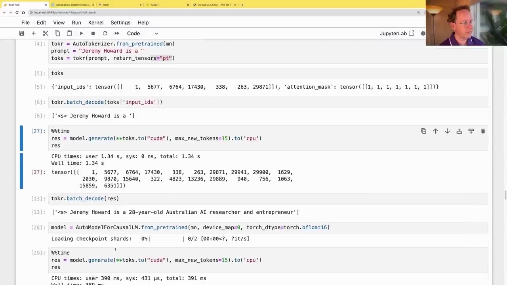
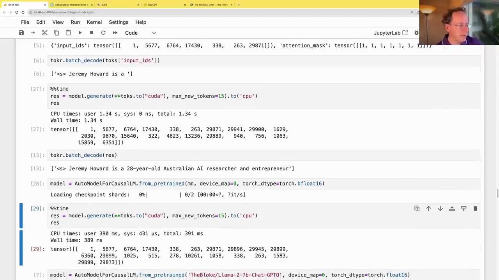

#  Choosing and Loading Language Models

### Evaluating Language Models

Evaluating the performance of large language models is a challenging task. Metrics like average likelihood or perplexity are not well-aligned with real-world usage scenarios. Additionally, there is a risk of leakage, where some of the evaluation data may have been inadvertently included in the training set, leading to inflated performance scores.



While leaderboards like the one shown above can provide a rough guideline for model selection, it is essential to validate the models on your specific use case. More sophisticated evaluation methods, such as the Chain of Thought evaluation or benchmarks like GSM-8K and Big Bench Hard, may offer more reliable insights into a model's capabilities.

### Loading Pre-trained Models

Most state-of-the-art language models are based on the Meta AI LLaMA (Language Model for Assistants) architecture. The LLaMA-2-7B model, for instance, is a 7 billion parameter version of LLaMA-2, pre-trained by Meta AI and optimized for use with the Hugging Face Transformers library.

```python
from transformers import AutoModelForCausalLM, AutoTokenizer
import torch

mn = "meta-llama/Llama-2-7b-hf"
model = AutoModelForCausalLM.from_pretrained(mn, device_map=0, load_in_8bit=True)
tokr = AutoTokenizer.from_pretrained(mn)
```

To conserve memory, these models can be loaded using 8-bit quantization, which compresses the model weights into 8-bit integers while maintaining reasonable performance through a process called discretization.

### Generating Text

Once loaded, the model can be used to generate text autoregressively, where the model's output is fed back as input for the next step.



```python
prompt = "Jeremy Howard is a "
toks = tokr(prompt, return_tensors="pt")

res = model.generate(**toks.to("cuda"), max_new_tokens=15, to('cpu')
tokr.batch_decode(res)
```

This code generates the output: "Jeremy Howard is a 28-year-old Australian AI researcher and entrepreneur."

### Performance Considerations

While 8-bit quantization reduces memory requirements, using 16-bit floating-point precision (bfloat16) can significantly improve performance, albeit at the cost of increased memory usage.

```python
model = AutoModelForCausalLM.from_pretrained(mn, device_map=0, torch_dtype=torch.bfloat16)
```

With bfloat16, the model can generate text in around 390 milliseconds, compared to 1.34 seconds with 8-bit quantization.

Another promising approach is the use of GPTQ, a quantization technique specifically designed for transformer models, which can further improve performance while maintaining accuracy.

In summary, evaluating and selecting the appropriate language model is a crucial step in building effective AI systems. While leaderboards and metrics can provide guidance, it is essential to validate the models on your specific use case and consider performance trade-offs when deploying them in production environments.