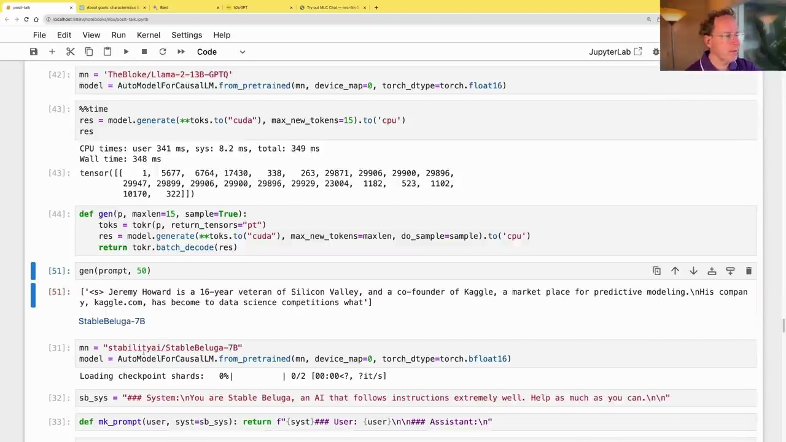
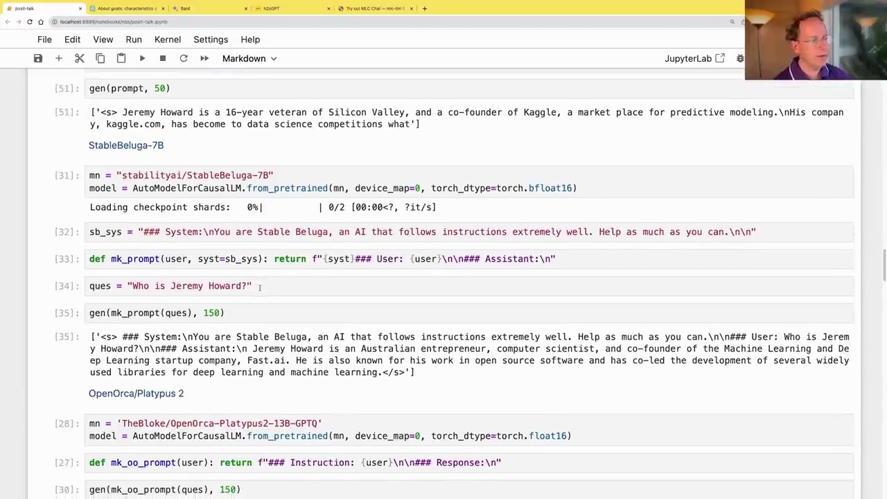

#  Optimizing and Quantizing Large Language Models

### Quantization with GPTQ



Quantization is a technique used to optimize large language models for faster inference and reduced memory footprint. The GPTQ (Quantization at Last Layer) approach carefully optimizes the model to work with lower precision data, such as 4-bit or 8-bit, while maintaining performance. This is achieved by quantizing the weights of the model and casting them to lower precision during inference.

The transcript demonstrates the use of a quantized version of the GPT model, optimized using GPTQ. Despite being quantized to a lower precision, the optimized model runs faster than the original 16-bit version, thanks to reduced memory movement and optimized computations.

```python
mm = 'TheBloke/Llama-2-13B-GPTQ'
model = AutoModelForCausalLM.from_pretrained(mm, device_map=0, torch_dtype=torch.float16)

%%time
res = model.generate(**toks.to("cuda"), max_new_tokens=15).to('cpu')
res
```

### Instruction-Tuned Models



Instruction-tuned models, such as the StableBeluga series from Stability AI, are fine-tuned on instruction-following datasets. These models are designed to understand and follow instructions more effectively than their base counterparts.

The transcript demonstrates the use of the StableBeluga-7B model, which is based on the LLaMA-2 architecture and has been instruction-tuned. To use these models correctly, it is important to follow the specified prompt format, as shown in the example:

```python
sb_sys = "### System:\nYou are Stable Beluga, an AI that follows instructions extremely well. Help as much as you can.\n\n"

def mk_prompt(user, syst=sb_sys): return f"{syst}### User: {user}\n\n### Assistant:\n"

ques = "Who is Jeremy Howard?"

gen(mk_prompt(ques), 150)
```

This ensures that the model receives the instructions in the expected format, leading to more accurate and relevant responses.

### Open-Source Models and Datasets

The transcript also mentions the use of open-source models and datasets, such as OpenOrca and Platypus 2. These resources are valuable for fine-tuning and adapting language models to specific domains or tasks.

```python
mm = 'TheBloke/OpenOrca-Platypus2-13B-GPTQ'
model = AutoModelForCausalLM.from_pretrained(mm, device_map=0, torch_dtype=torch.float16)

def mk_oo_prompt(user): return f"### Instruction: {user}\n\n### Response:\n"

gen(mk_oo_prompt(ques), 150)
```

By leveraging open-source models and datasets, researchers and developers can build upon existing work and contribute to the advancement of natural language processing technologies.

Overall, the transcript highlights the importance of quantization techniques, instruction-tuned models, and open-source resources in optimizing and adapting large language models for various applications and use cases.