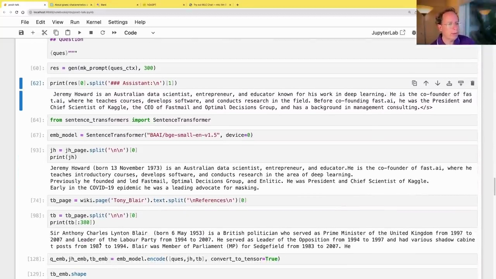
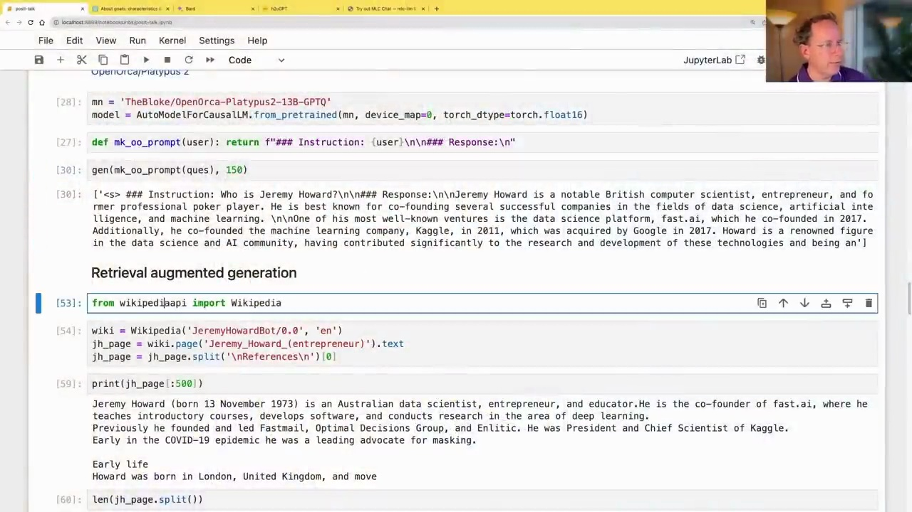
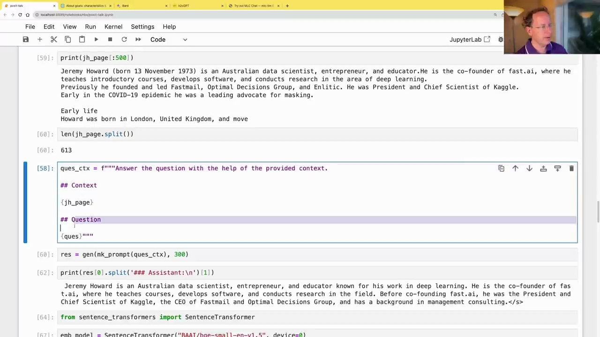
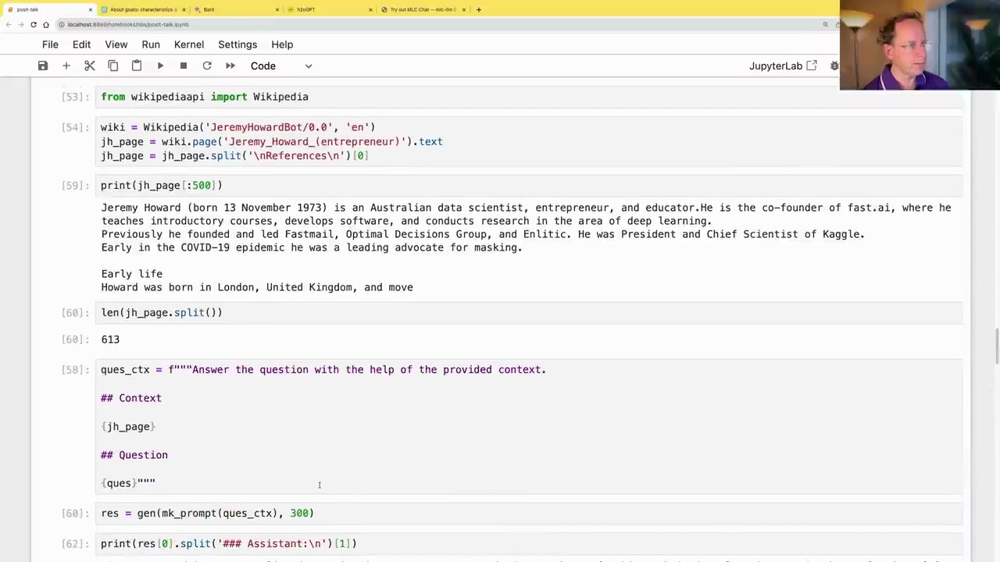

#  Retrieval Augmented Generation

### What is Retrieval Augmented Generation?

Retrieval Augmented Generation (RAG) is a technique used in natural language processing to improve the performance of language models by leveraging external knowledge sources. It involves two main steps:

1. **Retrieval**: Given a query or question, relevant documents or passages are retrieved from a knowledge base or corpus using a retrieval model.

2. **Generation**: The retrieved context is then provided as additional input to a language model, which generates the final answer or response based on both the query and the retrieved context.



The key idea behind RAG is to combine the strengths of retrieval systems, which can efficiently search and retrieve relevant information from large knowledge bases, with the language understanding and generation capabilities of modern language models.

### Example: Answering Questions with Wikipedia

To illustrate RAG, let's consider the example of answering the question "Who is Jeremy Howard?" using Wikipedia as the knowledge source.

First, we use a retrieval model to find the most relevant Wikipedia page for the given question. In this case, the Jeremy Howard Wikipedia page is identified as the most relevant document.

```python
from wikipediapi import Wikipedia

wiki = Wikipedia('JeremyHowardBot/0.0', 'en')
jh_page = wiki.page('Jeremy_Howard_(entrepreneur)').text
jh_page = jh_page.split('\n\nReferences\n')[0]

print(jh_page[:500])
```



Next, we provide the retrieved Wikipedia page as context to a language model, along with the original question.

```python
ques_ctx = f"""Answer the question with the help of the provided context.

## Context

{jh_page}

## Question

{ques}"""

res = gen(mk_prompt(ques_ctx), 300)

print(res[0].split('### Assistant:\n')[1])
```



The language model can now generate a response that combines the information from the Wikipedia page with its own language understanding capabilities, resulting in a more accurate and informative answer.

### Evaluating Relevance with Sentence Embeddings

To determine the relevance of a document for a given question, RAG often employs sentence embeddings. These are dense vector representations of text, where similar texts have similar embeddings.

```python
from sentence_transformers import SentenceTransformer

emb_model = SentenceTransformer("BAAT/bge-small-en-v1.5", device=0)

jh = jh_page.split('\n\n')[0]
print(jh)

tb_page = wiki.page('Tony_Blair').text.split('\n\nReferences\n')[0]

tb = tb_page.split('\n\n')[0]
print(tb[:380])

q_emb, jh_emb, tb_emb = emb_model.encode([ques, jh, tb], convert_to_tensor=True)

F.cosine_similarity(q_emb, jh_emb, dim=0)
F.cosine_similarity(q_emb, tb_emb, dim=0)
```



By calculating the cosine similarity between the question embedding and the document embeddings, we can identify the most relevant document for answering the question.

Retrieval Augmented Generation is a powerful technique that combines the strengths of retrieval systems and language models, enabling more accurate and informative responses to queries by leveraging external knowledge sources.