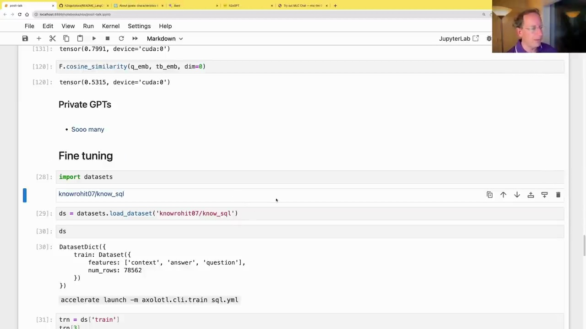
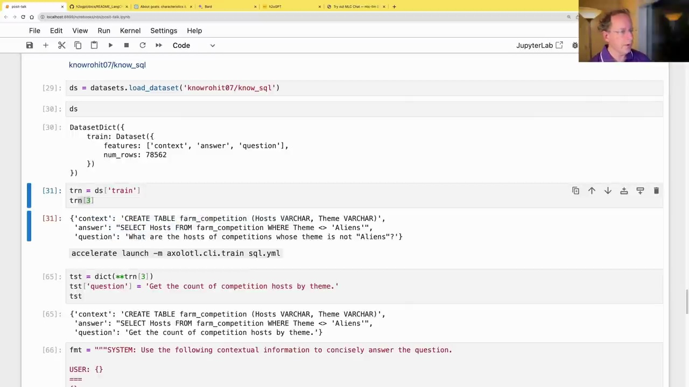
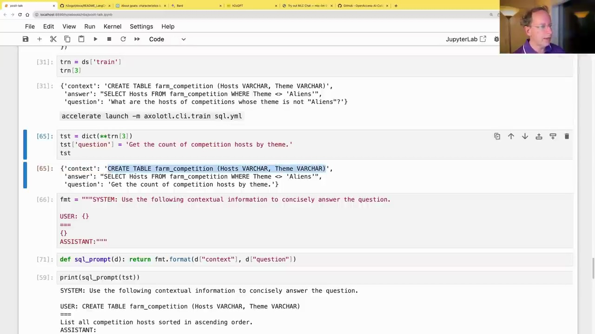

#  Fine-tuning GPT Models with SQL Datasets

### Private GPTs and Fine-tuning

There are numerous private GPT models available, as listed and compared on the H2O GPT webpage. These models offer options like retrieval-augmented generation. However, the most interesting approach is to perform our own fine-tuning, where we can adapt the model's behavior based on the available documents.



### Fine-tuning with SQL Dataset

In this example, we'll fine-tune a model using the `knowrohit07/know_sql` dataset from Hugging Face. This dataset contains examples of database table schemas, questions in natural language, and the corresponding SQL queries to answer those questions.

The goal is to create a tool that can generate SQL queries automatically from English questions, potentially useful for business users.

```python
import datasets

knowrohit07/know_sql

ds = datasets.load_dataset('knowrohit07/know_sql')
ds
```

The dataset consists of a training set with features like 'context' (table schema), 'answer' (SQL query), and 'question' (natural language query).



To fine-tune the model, we'll use the Axolotl library, which provides a convenient interface for fine-tuning with various models and configurations.

```
accelerate launch -m axolotl.cli.train sql.yml
```

This command fine-tunes the model using the specified configuration file (`sql.yml`) and saves the quantized model in the `qlora-out` directory.

### Testing the Fine-tuned Model



After fine-tuning, we can test the model by providing a context (table schema) and a question in natural language. The model should generate the corresponding SQL query.

```python
def sql_prompt(d): return fmt.format(d["context"], d["question"])

print(sql_prompt(tst))
```

```
SYSTEM: Use the following contextual information to concisely answer the question.

USER: CREATE TABLE farm_competition (Hosts VARCHAR, Theme VARCHAR)
...
List all competition hosts sorted in ascending order.
ASSISTANT: SELECT Hosts FROM farm_competition ORDER BY Hosts ASC;
```

The fine-tuned model successfully generates the correct SQL query to list all competition hosts in ascending order, given the table schema and the natural language question.

Overall, fine-tuning GPT models with domain-specific datasets like SQL queries can potentially enable powerful applications for querying databases using natural language.