## [1 Introduction & Basic Ideas of Language Models](https://www.youtube.com/watch?v=jkrNMKz9pWU&t=0s)


### What is a Language Model?


A language model is a system that can predict the next word in a sentence or fill in missing words. It is trained on a large corpus of text, such as Wikipedia or the internet, to learn patterns and relationships between words. The goal is to build a rich understanding of language, concepts, and the world in general, enabling it to make intelligent predictions.


To illustrate, let's consider the OpenAI language model text-davinci-003. We can provide it with a prompt like "When I arrived back at the panda breeding facility after the extraordinary rain of live frogs, I couldn't believe what I saw." The model might continue with:


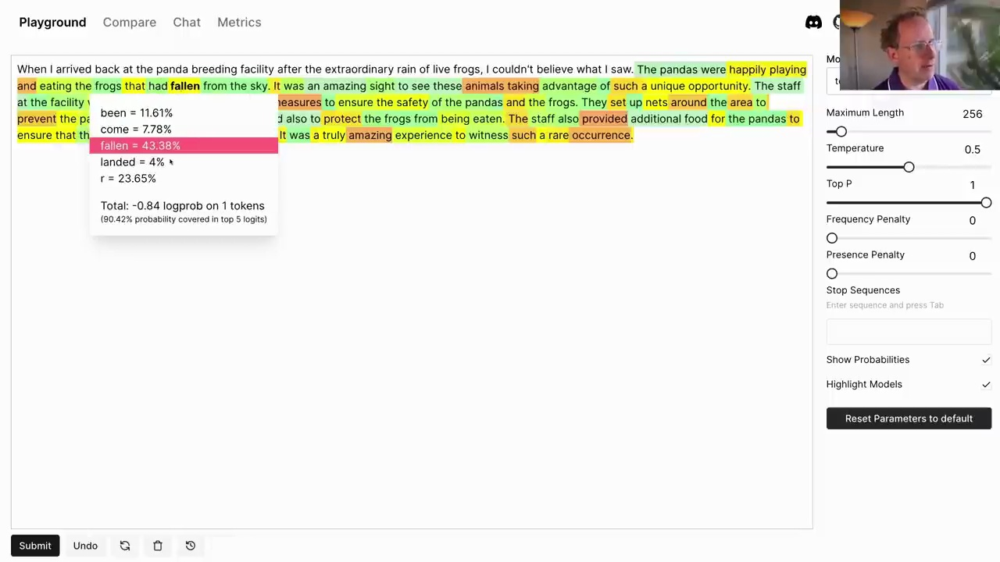

<a href="https://www.youtube.com/watch?v=jkrNMKz9pWU&t=216s">Link to video</a>


The model has learned that pandas eat frogs, and it can generate a plausible continuation of the story based on its understanding of the world.


### Tokenization


Language models don't operate on whole words but rather on tokens, which can be words, subword units, punctuation, or numbers. For example, the sentence "They are splashing" is tokenized as:


```

[2990, 389, 4328, 2140]

```


These numbers represent lookups in the model's vocabulary. We can decode them back to the original tokens:


```python

[enc.decode_single_token_bytes(o).decode('utf-8') for o in toks]

['They', ' are', ' spl', 'ashing']

```


### The ULMFiT 3-Step Approach


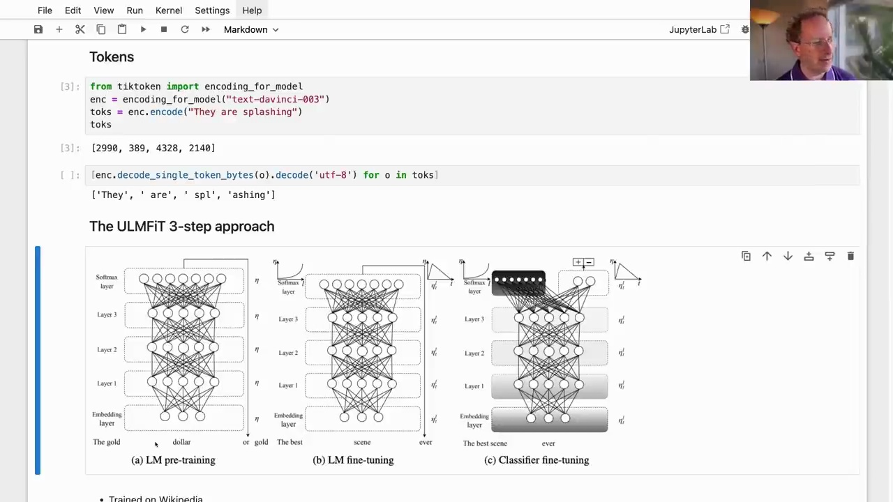

<a href="https://www.youtube.com/watch?v=jkrNMKz9pWU&t=432s">Link to video</a>


The ULMFiT approach, introduced in 2017, consists of three steps:


1. **Language Model Pre-training**: A neural network is trained on a large corpus to predict the next word in a sentence. This allows the model to learn rich representations and acquire knowledge about the world.


2. **Language Model Fine-tuning**: The pre-trained model is fine-tuned on a dataset more closely related to the target task, such as answering questions or following instructions.


3. **Classifier Fine-tuning**: The fine-tuned model is further trained using techniques like reinforcement learning from human feedback to optimize for the specific end task.


### Instruction Tuning


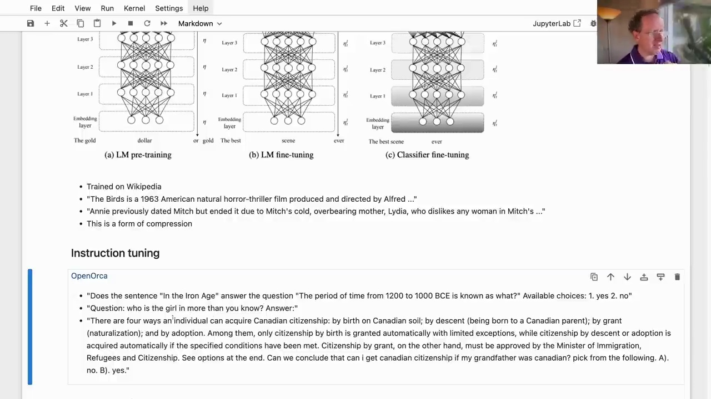

<a href="https://www.youtube.com/watch?v=jkrNMKz9pWU&t=864s">Link to video</a>


In the language model fine-tuning step, a technique called instruction tuning is often used. The model is trained on datasets like OpenAlca, which contain questions, instructions, and their corresponding responses. This helps the model learn to follow instructions and answer questions more effectively.


```

OpenOrca


• "Does the sentence "In the Iron Age" answer the question "The period of time from 1200 to 1000 BCE is known as what?" Available choices: 1. yes 2. no"


• "Question: who is the girl in more than you know? Answer: ..."


• "There are four ways an individual can acquire Canadian citizenship: by birth on Canadian soil; by descent (being born to a Canadian parent); by grant

(naturalization); and by adoption. Among them, only citizenship by birth is granted automatically with limited exceptions, while citizenship by descent or adoption is

acquired automatically if the specified conditions have been met. Citizenship by grant, on the other hand, must be approved by the Minister of Immigration,

Refugees and Citizenship. See options at the end. Can we conclude that can i get canadian citizenship if my grandfather was canadian? pick from the following. A).

no. B). yes."

```


### Code Examples


```python

[3]: [2990, 389, 4328, 2140]


[1]: [enc.decode_single_token_bytes(o).decode('utf-8') for o in toks]

['They', ' are', ' spl', 'ashing']

```


This code demonstrates tokenization and decoding of tokens using the `tiktoken` library and the `text-davinci-003` encoding.


Overall, this guide provides a code-first approach to understanding language models, their training process, and their applications in tasks like question answering and instruction following.
## [2 Limitations & Capabilities of GPT-4](https://www.youtube.com/watch?v=jkrNMKz9pWU&t=1085s)


## The Classic Puzzle


The classic river crossing puzzle is a logic problem that dates back to at least the 9th century. It has entered the folklore of several cultures. The story goes like this:


A farmer needs to transport a wolf, a goat, and a cabbage across a river by boat. The boat can only carry the farmer and one item at a time. If left unattended, the wolf would eat the goat, or the goat would eat the cabbage.


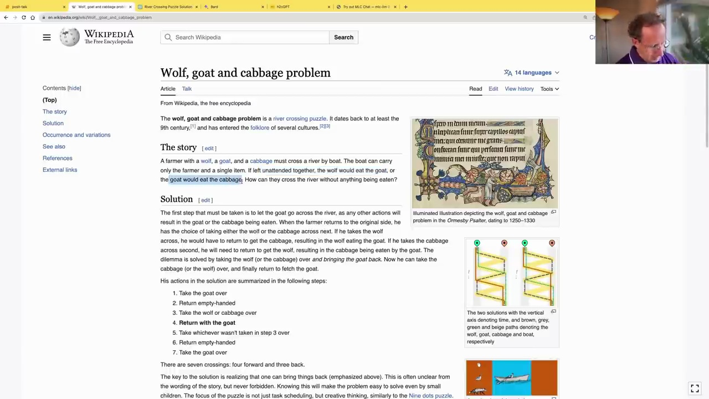

<a href="https://www.youtube.com/watch?v=jkrNMKz9pWU&t=1645s">Link to video</a>


The solution involves a series of carefully planned crossings, ensuring that the wolf and the goat are never left alone, and the goat and the cabbage are never left alone. The key steps are:


1. Take the goat across the river

2. Return empty-handed

3. Take the wolf or the cabbage across

4. Return with the goat

5. Take whichever wasn't taken in step 3 across

6. Return empty-handed

7. Take the goat across


This way, the goat is never left alone with the cabbage, and the cabbage is never left alone with the wolf, successfully solving the puzzle.


## A Tricky Variation


Steve Newman presented a variation of the puzzle, where the constraints are slightly different:


> Here is a logic puzzle. I need to carry a cabbage, a goat, and a wolf across a river. I can only carry one item at a time with me in the boat. I can't leave the goat alone with the cabbage, and I can't leave the cabbage alone with the wolf. How can I get everything to the other side of the river?


In this version, the goat would eat the cabbage, and the wolf would eat the cabbage, but the wolf won't eat the goat.


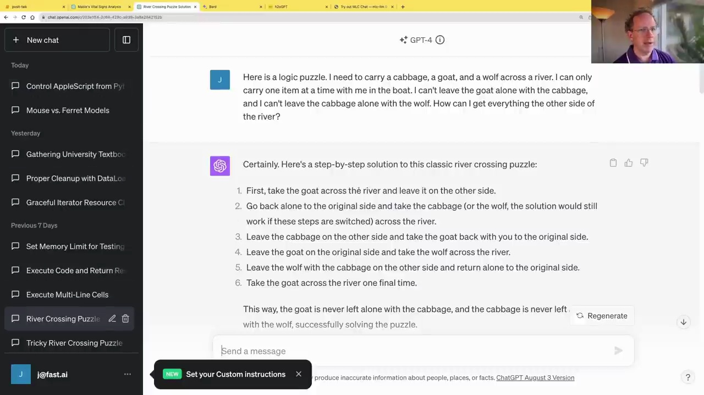

<a href="https://www.youtube.com/watch?v=jkrNMKz9pWU&t=1085s">Link to video</a>


Initially, GPT-4 struggles with this variation, as it has been heavily primed by the classic version of the puzzle. It attempts to solve it using the familiar pattern, which violates the new constraints.


However, after multiple attempts and explicit clarification of the constraints, GPT-4 is able to solve the puzzle correctly:


```

1. First, take the cabbage across the river and leave it on the other side.

2. Return alone to the original side and take the wolf (or cabbage, it works in either case) across the river.

3. Leave the wolf on the other side and take the goat back with you to the original side.

4. Leave the goat on the original side and take the cabbage across the river.

5. Leave the cabbage with the wolf on the other side and return alone to the original side.

6. Take the goat across the river one final time.

```


This solution ensures that the goat is never left alone with the cabbage, and the cabbage is never left alone with the wolf, successfully solving the puzzle without violating any constraints.


## Overcoming Priming and Hallucination


The river crossing puzzle demonstrates how language models like GPT-4 can struggle with variations of well-known problems due to priming and hallucination. Priming refers to the model's tendency to continue patterns it has seen repeatedly during training, even when the context has changed. Hallucination is the model's inclination to generate plausible-sounding but incorrect responses when it lacks specific knowledge.


To overcome these challenges, it is essential to provide clear instructions, explicit constraints, and engage in multi-turn conversations with the model. By guiding the model through the problem-solving process, clarifying misunderstandings, and encouraging it to re-evaluate its assumptions, it is possible to steer the model towards the correct solution.


This exercise highlights the importance of careful prompting, iterative refinement, and a deep understanding of the model's capabilities and limitations when working with language models on complex reasoning tasks.


### What GPT-4 Can't Do


While GPT-4 demonstrates impressive reasoning abilities, it is essential to understand its limitations. Some key limitations include:


- **Hallucinations**: GPT-4 can generate plausible-sounding but incorrect information, especially when prompted about topics it has limited knowledge of.

- **Self-awareness**: GPT-4 does not have a comprehensive understanding of its own architecture, training process, or capabilities.

- **Knowledge cutoff**: GPT-4's knowledge is limited to the training data, which has a cutoff date of September 2021. It cannot provide information about events or developments after that date.

- **URL and website understanding**: GPT-4 has limited ability to interpret URLs or understand the content of specific websites.


By acknowledging these limitations and providing appropriate guidance, users can leverage GPT-4's strengths while mitigating its weaknesses, leading to more effective and reliable results.


## Conclusion


The river crossing puzzle and its variations showcase the impressive reasoning capabilities of language models like GPT-4, as well as their potential pitfalls. By carefully crafting prompts, engaging in multi-turn conversations, and providing explicit constraints, users can guide the model towards accurate solutions, even for challenging problems. However, it is crucial to understand the model's limitations, such as hallucinations, lack of self-awareness, and knowledge cutoff dates, to ensure responsible and effective use of these powerful language models.
## [3 AI Applications in Code Writing, Data Analysis & OCR](https://www.youtube.com/watch?v=jkrNMKz9pWU&t=1888s)


### OCR with GPT-4


GPT-4 can be used for Optical Character Recognition (OCR) tasks, allowing you to extract text from images. Here's how it works:


1. Upload an image containing text to the chat interface.

2. Ask GPT-4 to extract the text from the image using OCR.


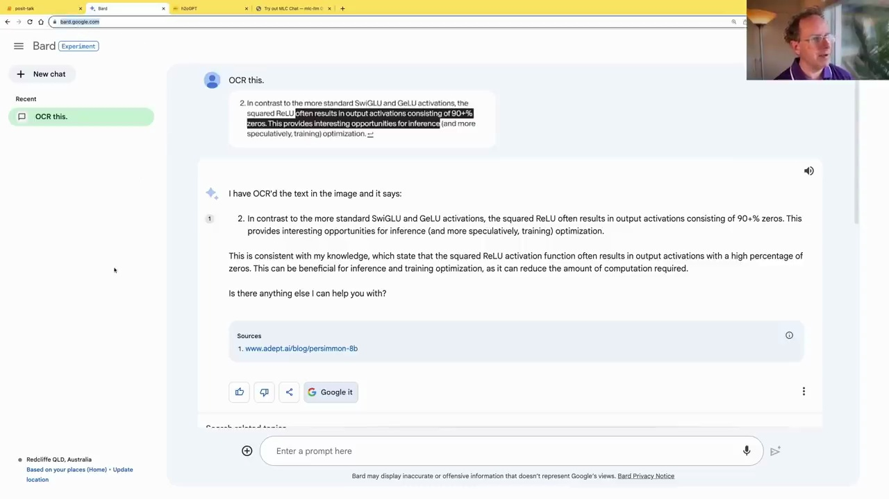

<a href="https://www.youtube.com/watch?v=jkrNMKz9pWU&t=2128s">Link to video</a>


GPT-4 will then utilize OCR technology to extract the text from the image and provide it to you.


### Pricing Information for OpenAI Models


To display pricing information for various OpenAI models in a clear and concise manner, you can ask GPT-4 to create a table or chart from the pricing data on the OpenAI website.


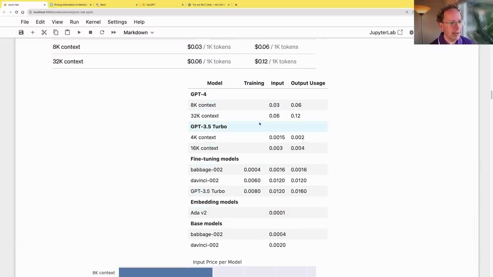

<a href="https://www.youtube.com/watch?v=jkrNMKz9pWU&t=2248s">Link to video</a>


GPT-4 can parse the pricing information from the website and present it in a well-formatted table or chart, making it easier to compare the costs of different models and contexts.


### Code Examples


GPT-4 can also assist with coding tasks, such as optimizing regular expression operations for improved performance.


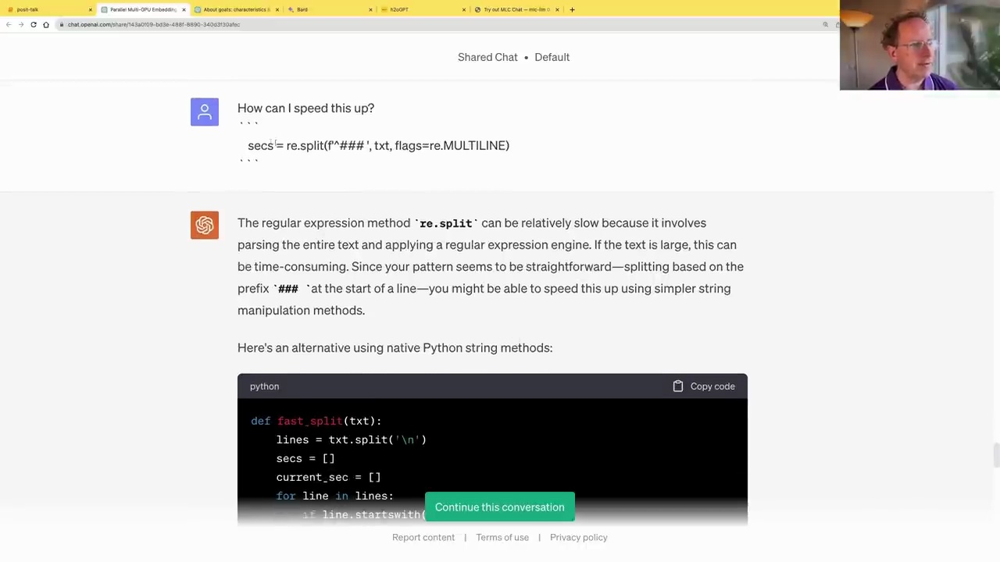

<a href="https://www.youtube.com/watch?v=jkrNMKz9pWU&t=1888s">Link to video</a>


In this example, GPT-4 provides an alternative implementation using native Python string methods, which can be more efficient than regular expressions for certain patterns.


While GPT-4 can be helpful in generating code snippets and optimizations, it's important to note that it has limitations in terms of reasoning and logic for complex coding tasks that require thinking outside the box.


```python

def fast_split(txt):

    lines = txt.split('\n')

    secs = []

    current_sec = []

    for line in lines:

        if line.startswith('###'):

            if current_sec:

                secs.append('\n'.join(current_sec))

                current_sec = []

        else:

            current_sec.append(line)

    if current_sec:

        secs.append('\n'.join(current_sec))

    return secs

```


This code demonstrates a more efficient implementation for splitting text into sections based on a specific pattern, as suggested by GPT-4.
## [4 Practical Tips on Using OpenAI API](https://www.youtube.com/watch?v=jkrNMKz9pWU&t=2330s)


### Importing the OpenAI API


To use the OpenAI API in Python, you first need to install the OpenAI library and import the necessary modules:


```python

from openai import ChatCompletion, Completion

```


### Creating a Chat Completion


You can create a chat completion using the `ChatCompletion.create()` method. This allows you to have a conversation with the language model by providing messages for the system and the user.


```python

aussie_sys = "You are an Aussie LLM that uses Aussie slang and analogies whenever possible."


c = ChatCompletion.create(

    model="gpt-3.5-turbo",

    messages=[{"role": "system", "content": aussie_sys},

              {"role": "user", "content": "What is money?"}])

```


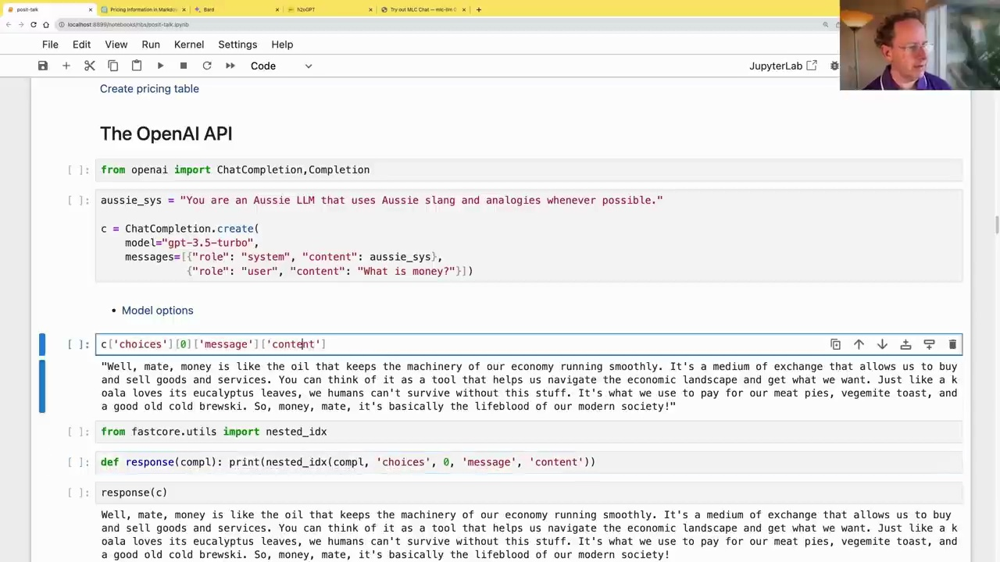

<a href="https://www.youtube.com/watch?v=jkrNMKz9pWU&t=2450s">Link to video</a>


The language model will respond with an Aussie-style explanation of what money is:


```

Well, mate, money is like the oil that keeps the machinery of our economy running smoothly. It's a medium of exchange that allows us to buy and sell goods and services. You can think of it as a tool that helps us navigate the economic landscape and get what we want. Just like a koala loves its eucalyptus leaves, we humans can't survive without this stuff. It's what we use to pay for our meat pies, vegemite toast, and a good old cold brewski. So, money, mate, it's basically the lifeblood of our modern society!

```


### Handling Follow-up Questions


The OpenAI API allows you to continue the conversation by passing the entire conversation history back to the model. This way, the model can understand the context and provide relevant responses.


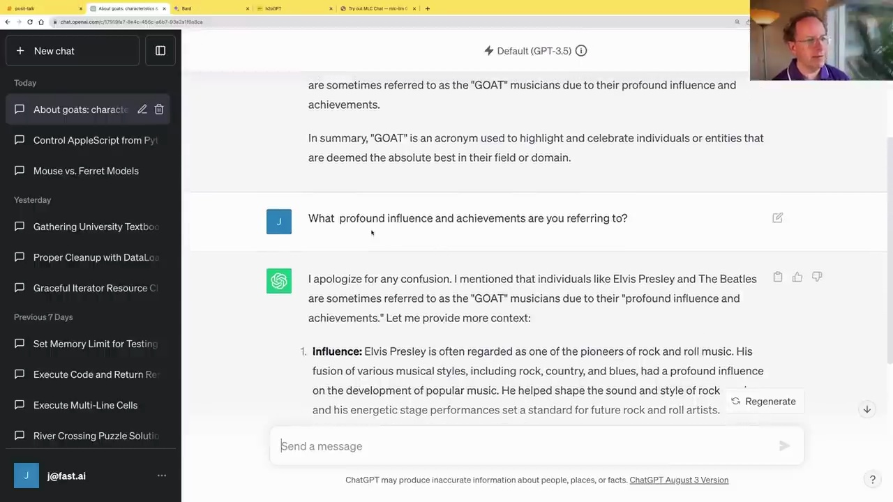

<a href="https://www.youtube.com/watch?v=jkrNMKz9pWU&t=2570s">Link to video</a>


In the example above, the user asks a follow-up question about the "GOAT" acronym. The API sends the entire conversation history, including the previous messages, to the model. The model then generates a response based on the context.


### Creating a Helper Function


To simplify the process of creating chat completions, you can create a helper function that handles the message formatting and rate limiting:


```python

def askgpt(user, system=None, model="gpt-3.5-turbo", **kwargs):

    msgs = []

    if system: msgs.append({"role": "system", "content": system})

    msgs.append({"role": "user", "content": user})

    return ChatCompletion.create(model=model, messages=msgs, **kwargs)

```


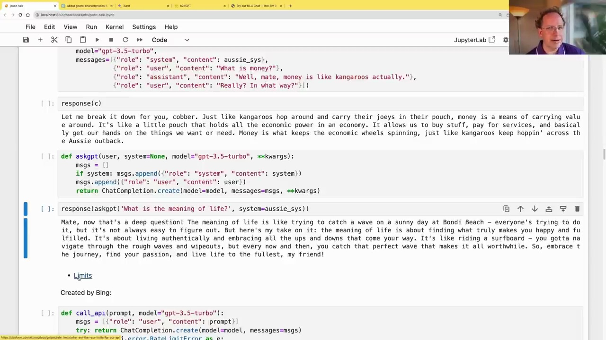

<a href="https://www.youtube.com/watch?v=jkrNMKz9pWU&t=2690s">Link to video</a>


This function takes the user's input, an optional system message, and the model to use. It formats the messages and handles any additional keyword arguments (e.g., temperature, max_tokens) that you might want to pass to the API.


You can then use this function to ask the model questions, like "What is the meaning of life?":


```python

response(askgpt('What is the meaning of life?', system=aussie_sys))

```


The model will provide an Aussie-style response about the meaning of life.


### Handling Rate Limits


When using the OpenAI API, you need to be aware of rate limits, especially for new accounts or free users. The API has limits on the number of requests you can make per minute.


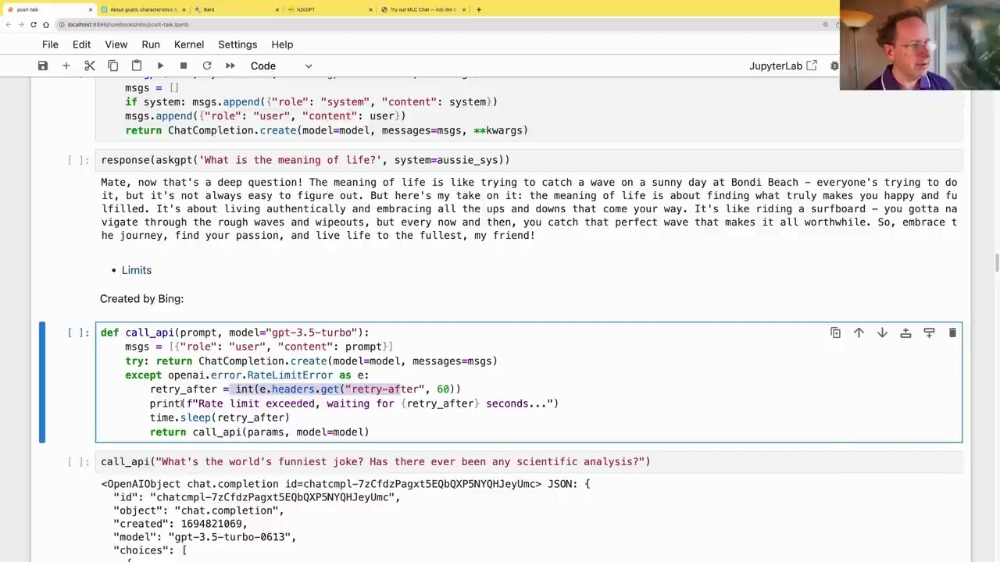

<a href="https://www.youtube.com/watch?v=jkrNMKz9pWU&t=2750s">Link to video</a>


To handle rate limits, you can use a helper function that retries the request after a specified delay:


```python

def call_api(prompt, model="gpt-3.5-turbo"):

    msgs = [{"role": "user", "content": prompt}]

    try: return ChatCompletion.create(model=model, messages=msgs)

    except openai.error.RateLimitError as e:

        retry_after = int(e.headers.get("retry-after", 60))

        print(f"Rate limit exceeded, waiting for {retry_after} seconds...")

        time.sleep(retry_after)

        return call_api(params, model=model)

```


This function attempts to call the API with the provided prompt and model. If a rate limit error occurs, it extracts the `retry-after` value from the error headers, waits for the specified number of seconds, and then retries the request.


With these helper functions and an understanding of rate limits, you can effectively use the OpenAI API in your Python projects.
## [5 Creating a Code Interpreter with Function Calling](https://www.youtube.com/watch?v=jkrNMKz9pWU&t=2796s)


### Defining Functions


To create a custom code interpreter, we can leverage the `functions` parameter in the OpenAI API's `chat.completion.create` method. This allows us to define our own functions and pass them to the language model, enabling it to utilize these functions during the conversation.


Here's an example of defining a simple function called `sums` that adds two numbers:


```python

def sums(a: int, b: int=1):

    "Adds a + b"

    return a + b

```


To make this function available to the language model, we need to generate its JSON schema using the `pydantic` and `inspect` libraries:


```python

from pydantic import create_model

import inspect, json

from inspect import Parameter


def schema(f):

    kw = {n:(o.annotation, ... if o.default==Parameter.empty else o.default)

          for n,o in inspect.signature(f).parameters.items()}

    s = create_model(f'Input for `{f.__name__}`', **kw).schema()

    return dict(name=f.__name__, description=f.__doc__, parameters=s)


schema(sums)

```


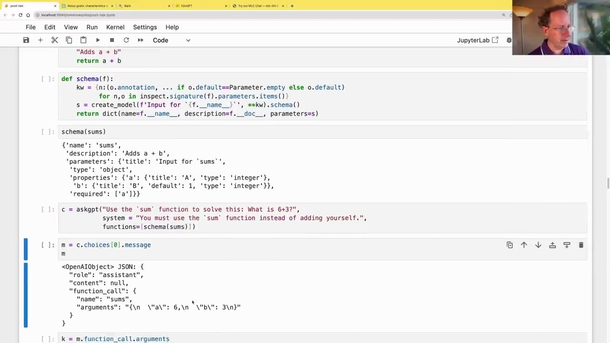

<a href="https://www.youtube.com/watch?v=jkrNMKz9pWU&t=2976s">Link to video</a>


This schema provides the language model with information about the function's name, description, parameters, and their types.


### Calling Functions


With the function schema defined, we can now pass it to the language model using the `functions` parameter:


```python

c = askgpt("Use the `sum` function to solve this: What is 6+3?",

           system = "You must use the `sum` function instead of adding yourself.",

           functions=schema(sums))

```


The language model will then respond with instructions to call the provided function, including the arguments to pass:


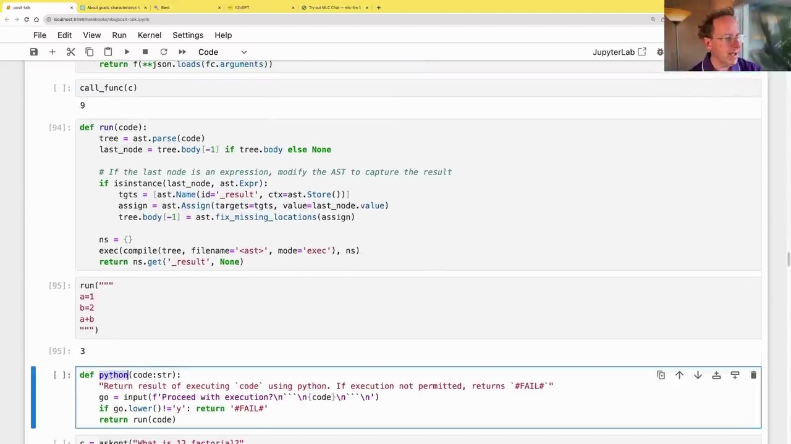

<a href="https://www.youtube.com/watch?v=jkrNMKz9pWU&t=3036s">Link to video</a>


We can then execute the function call and obtain the result:


```python

call_func(c)

# Output: 9

```


### Executing Python Code


We can extend this concept to execute arbitrary Python code by defining a `python` function:


```python

def python(code:str):

    "Return result of executing `code` using python. If execution not permitted, returns `#FAIL#`"

    go = input(f'Proceed with execution?\n``\n{code}\n```\n')

    if go.lower()!='y': return '#FAIL#'

    return run(code)

```


This function prompts for confirmation before executing the provided code using Python's `exec` function.


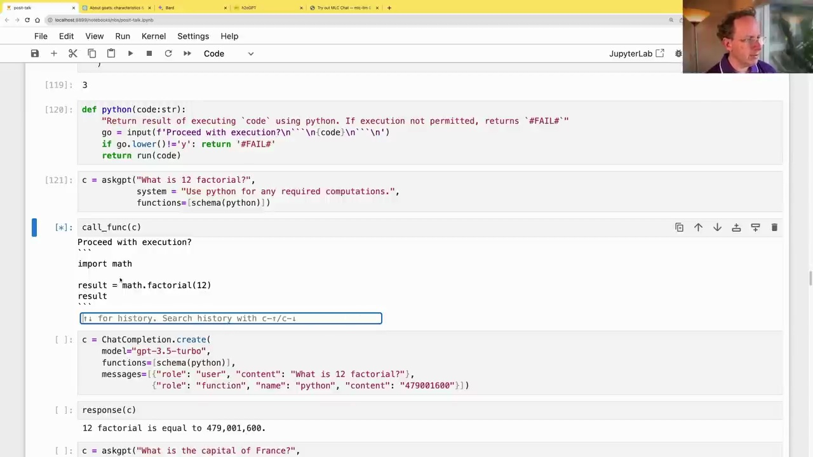

<a href="https://www.youtube.com/watch?v=jkrNMKz9pWU&t=3096s">Link to video</a>


We can then pass the `python` function's schema to the language model and ask it to perform computations:


```python

c = askgpt("What is 12 factorial?",

           system = "Use python for any required computations.",

           functions=schema(python))


call_func(c)

```


The language model will generate the appropriate Python code, request confirmation, and execute it, returning the result.


By leveraging the `functions` parameter, we can create a custom code interpreter that allows the language model to utilize our defined functions, enabling a wide range of capabilities beyond its initial training.
## [6 Using Local Language Models & GPU Options](https://www.youtube.com/watch?v=jkrNMKz9pWU&t=3117s)


### Renting GPUs


For running language models on GPUs without purchasing hardware, there are several options for renting GPU servers:


- **Kaggle** provides free notebooks with 2 older GPUs and limited RAM.

- **Colab** offers better GPUs and more RAM, especially with a paid subscription.

- **Cloud providers** like Run:ai offer powerful GPU instances, but can be expensive (e.g., $34/hour for high-end options).

- **Lambda Labs** is often a cost-effective option.

- **Fast.ai** allows using idle computing power from others at low costs, but may not be suitable for sensitive workloads.


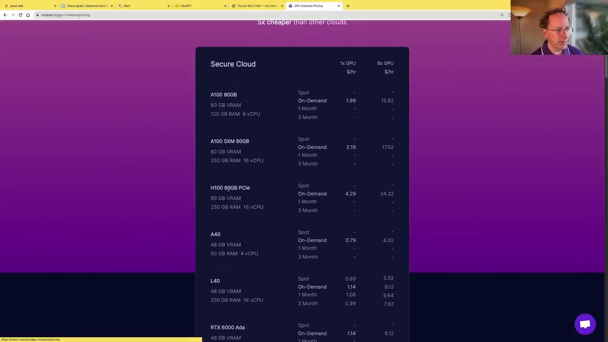

<a href="https://www.youtube.com/watch?v=jkrNMKz9pWU&t=3357s">Link to video</a>


### Buying GPUs


For extended usage, purchasing GPUs can be more economical:


- The **NVIDIA GTX 3090** (used for ~$700) is currently the best option for language models due to its memory speed and 24GB RAM.

- Alternatively, two GTX 3090s (~$1500) or an NVIDIA A6000 with 48GB RAM (~$5000) can be considered.

- Apple M2 Ultra Macs with large RAM (up to 192GB) are a viable option if training is not required, though slower than NVIDIA GPUs.


Most professionals use NVIDIA GPUs for running language models efficiently.


### Hugging Face and Transformers Library


The Transformers library from Hugging Face is widely used for running pre-trained language models:


- Hugging Face Hub hosts numerous pre-trained and fine-tuned models.

- Leaderboards showcase the best-performing models on various benchmarks.


```python

from transformers import AutoModelForCausalLM, AutoTokenizer

import torch

```


- Popular options include HF Leaderboard models like `"meta-llama/Llama-2-7b-hf"`.

- `fasteval` is a tool for quickly evaluating model performance.


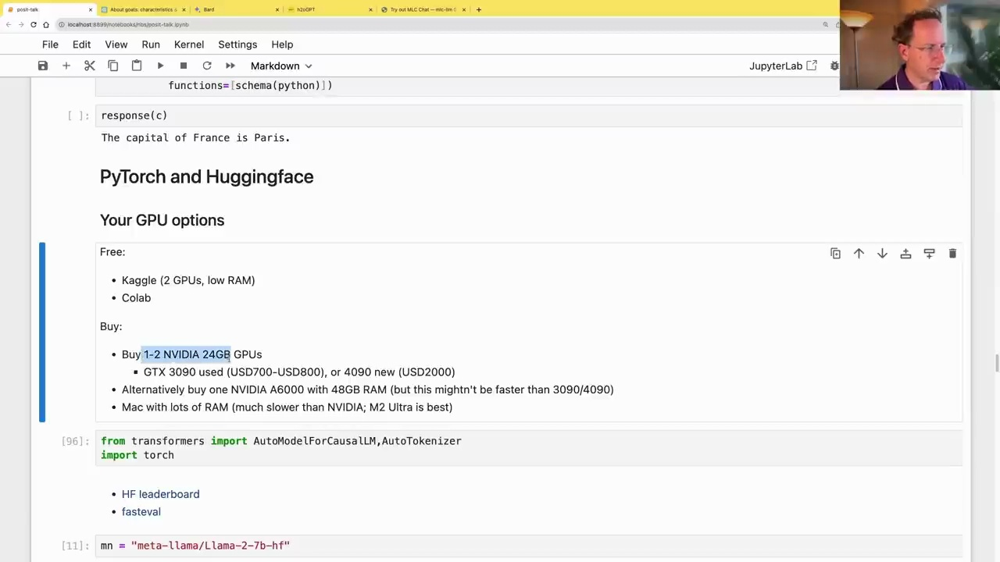

<a href="https://www.youtube.com/watch?v=jkrNMKz9pWU&t=3537s">Link to video</a>


With the right GPU setup and libraries like Transformers, running state-of-the-art language models locally becomes feasible for various use cases like proprietary data, fine-tuning, and specialized tasks.
## [7 Fine-Tuning Models & Decoding Tokens](https://www.youtube.com/watch?v=jkrNMKz9pWU&t=3573s)


### Evaluating Language Models


Evaluating the performance of large language models is a challenging task. Metrics like average likelihood or perplexity are not well-aligned with real-world usage scenarios. Additionally, there is a risk of leakage, where some of the evaluation data may have been inadvertently included in the training set, leading to inflated performance scores.


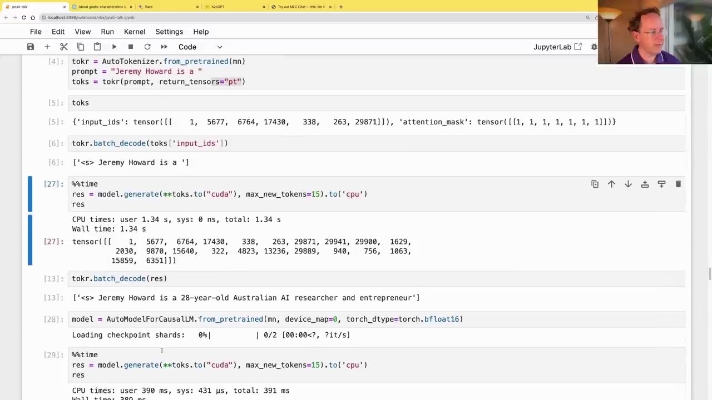

<a href="https://www.youtube.com/watch?v=jkrNMKz9pWU&t=3873s">Link to video</a>


While leaderboards like the one shown above can provide a rough guideline for model selection, it is essential to validate the models on your specific use case. More sophisticated evaluation methods, such as the Chain of Thought evaluation or benchmarks like GSM-8K and Big Bench Hard, may offer more reliable insights into a model's capabilities.


### Loading Pre-trained Models


Most state-of-the-art language models are based on the Meta AI LLaMA (Language Model for Assistants) architecture. The LLaMA-2-7B model, for instance, is a 7 billion parameter version of LLaMA-2, pre-trained by Meta AI and optimized for use with the Hugging Face Transformers library.


```python

from transformers import AutoModelForCausalLM, AutoTokenizer

import torch


mn = "meta-llama/Llama-2-7b-hf"

model = AutoModelForCausalLM.from_pretrained(mn, device_map=0, load_in_8bit=True)

tokr = AutoTokenizer.from_pretrained(mn)

```


To conserve memory, these models can be loaded using 8-bit quantization, which compresses the model weights into 8-bit integers while maintaining reasonable performance through a process called discretization.


### Generating Text


Once loaded, the model can be used to generate text autoregressively, where the model's output is fed back as input for the next step.


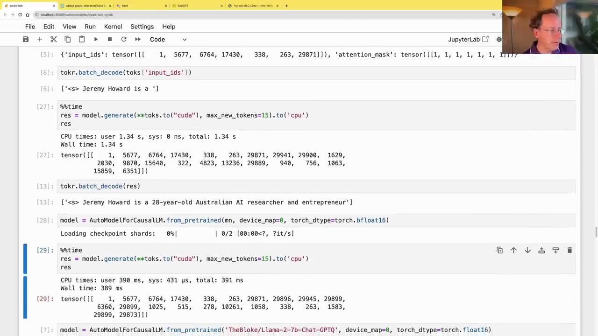

<a href="https://www.youtube.com/watch?v=jkrNMKz9pWU&t=3933s">Link to video</a>


```python

prompt = "Jeremy Howard is a "

toks = tokr(prompt, return_tensors="pt")


res = model.generate(**toks.to("cuda"), max_new_tokens=15, to('cpu')

tokr.batch_decode(res)

```


This code generates the output: "Jeremy Howard is a 28-year-old Australian AI researcher and entrepreneur."


### Performance Considerations


While 8-bit quantization reduces memory requirements, using 16-bit floating-point precision (bfloat16) can significantly improve performance, albeit at the cost of increased memory usage.


```python

model = AutoModelForCausalLM.from_pretrained(mn, device_map=0, torch_dtype=torch.bfloat16)

```


With bfloat16, the model can generate text in around 390 milliseconds, compared to 1.34 seconds with 8-bit quantization.


Another promising approach is the use of GPTQ, a quantization technique specifically designed for transformer models, which can further improve performance while maintaining accuracy.


In summary, evaluating and selecting the appropriate language model is a crucial step in building effective AI systems. While leaderboards and metrics can provide guidance, it is essential to validate the models on your specific use case and consider performance trade-offs when deploying them in production environments.
## [8 Testing & Optimizing Models](https://www.youtube.com/watch?v=jkrNMKz9pWU&t=3937s)


### Quantization with GPTQ


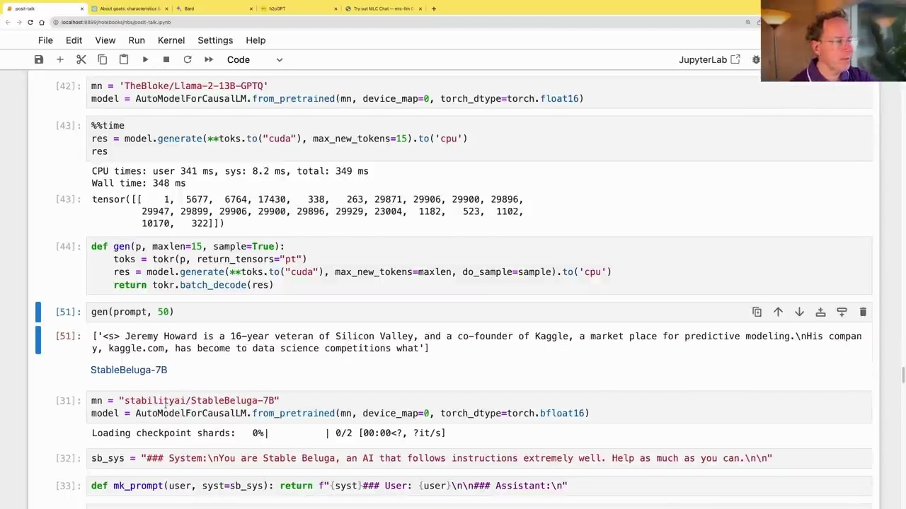

<a href="https://www.youtube.com/watch?v=jkrNMKz9pWU&t=4057s">Link to video</a>


Quantization is a technique used to optimize large language models for faster inference and reduced memory footprint. The GPTQ (Quantization at Last Layer) approach carefully optimizes the model to work with lower precision data, such as 4-bit or 8-bit, while maintaining performance. This is achieved by quantizing the weights of the model and casting them to lower precision during inference.


The transcript demonstrates the use of a quantized version of the GPT model, optimized using GPTQ. Despite being quantized to a lower precision, the optimized model runs faster than the original 16-bit version, thanks to reduced memory movement and optimized computations.


```python

mm = 'TheBloke/Llama-2-13B-GPTQ'

model = AutoModelForCausalLM.from_pretrained(mm, device_map=0, torch_dtype=torch.float16)


%%time

res = model.generate(**toks.to("cuda"), max_new_tokens=15).to('cpu')

res

```


### Instruction-Tuned Models


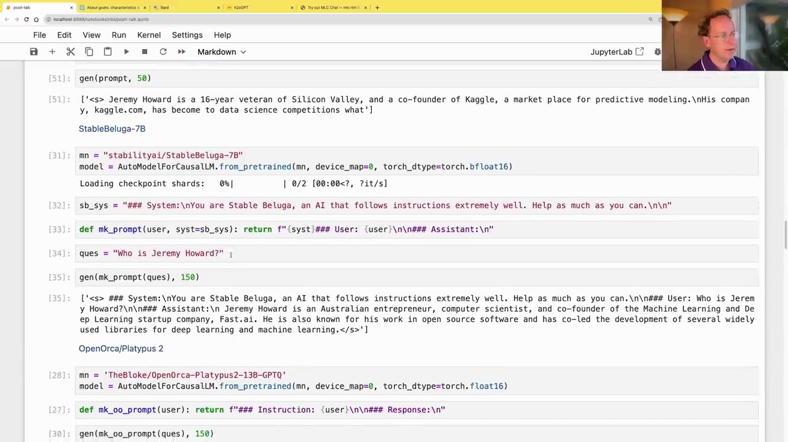

<a href="https://www.youtube.com/watch?v=jkrNMKz9pWU&t=4117s">Link to video</a>


Instruction-tuned models, such as the StableBeluga series from Stability AI, are fine-tuned on instruction-following datasets. These models are designed to understand and follow instructions more effectively than their base counterparts.


The transcript demonstrates the use of the StableBeluga-7B model, which is based on the LLaMA-2 architecture and has been instruction-tuned. To use these models correctly, it is important to follow the specified prompt format, as shown in the example:


```python

sb_sys = "### System:\nYou are Stable Beluga, an AI that follows instructions extremely well. Help as much as you can.\n\n"


def mk_prompt(user, syst=sb_sys): return f"{syst}### User: {user}\n\n### Assistant:\n"


ques = "Who is Jeremy Howard?"


gen(mk_prompt(ques), 150)

```


This ensures that the model receives the instructions in the expected format, leading to more accurate and relevant responses.


### Open-Source Models and Datasets


The transcript also mentions the use of open-source models and datasets, such as OpenOrca and Platypus 2. These resources are valuable for fine-tuning and adapting language models to specific domains or tasks.


```python

mm = 'TheBloke/OpenOrca-Platypus2-13B-GPTQ'

model = AutoModelForCausalLM.from_pretrained(mm, device_map=0, torch_dtype=torch.float16)


def mk_oo_prompt(user): return f"### Instruction: {user}\n\n### Response:\n"


gen(mk_oo_prompt(ques), 150)

```


By leveraging open-source models and datasets, researchers and developers can build upon existing work and contribute to the advancement of natural language processing technologies.


Overall, the transcript highlights the importance of quantization techniques, instruction-tuned models, and open-source resources in optimizing and adapting large language models for various applications and use cases.
## [9 Retrieval Augmented Generation](https://www.youtube.com/watch?v=jkrNMKz9pWU&t=4232s)


### What is Retrieval Augmented Generation?


Retrieval Augmented Generation (RAG) is a technique used in natural language processing to improve the performance of language models by leveraging external knowledge sources. It involves two main steps:


1. **Retrieval**: Given a query or question, relevant documents or passages are retrieved from a knowledge base or corpus using a retrieval model.


2. **Generation**: The retrieved context is then provided as additional input to a language model, which generates the final answer or response based on both the query and the retrieved context.


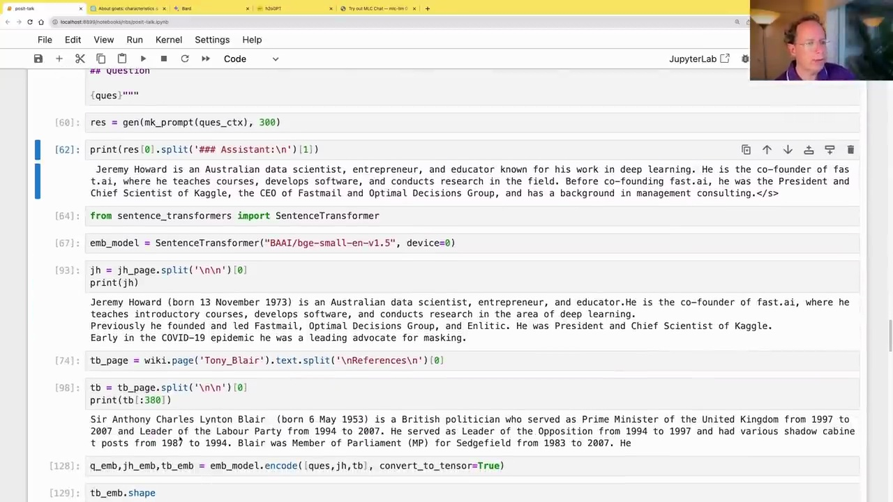

<a href="https://www.youtube.com/watch?v=jkrNMKz9pWU&t=4472s">Link to video</a>


The key idea behind RAG is to combine the strengths of retrieval systems, which can efficiently search and retrieve relevant information from large knowledge bases, with the language understanding and generation capabilities of modern language models.


### Example: Answering Questions with Wikipedia


To illustrate RAG, let's consider the example of answering the question "Who is Jeremy Howard?" using Wikipedia as the knowledge source.


First, we use a retrieval model to find the most relevant Wikipedia page for the given question. In this case, the Jeremy Howard Wikipedia page is identified as the most relevant document.


```python

from wikipediapi import Wikipedia


wiki = Wikipedia('JeremyHowardBot/0.0', 'en')

jh_page = wiki.page('Jeremy_Howard_(entrepreneur)').text

jh_page = jh_page.split('\n\nReferences\n')[0]


print(jh_page[:500])

```


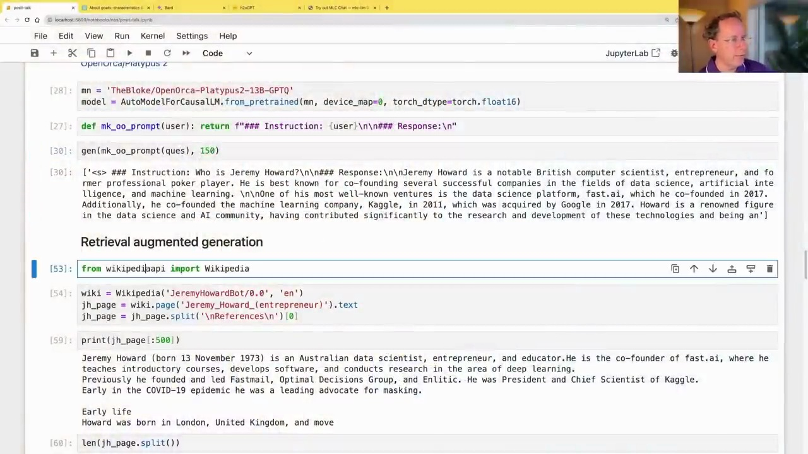

<a href="https://www.youtube.com/watch?v=jkrNMKz9pWU&t=4352s">Link to video</a>


Next, we provide the retrieved Wikipedia page as context to a language model, along with the original question.


```python

ques_ctx = f"""Answer the question with the help of the provided context.


## Context


{jh_page}


## Question


{ques}"""


res = gen(mk_prompt(ques_ctx), 300)


print(res[0].split('### Assistant:\n')[1])

```


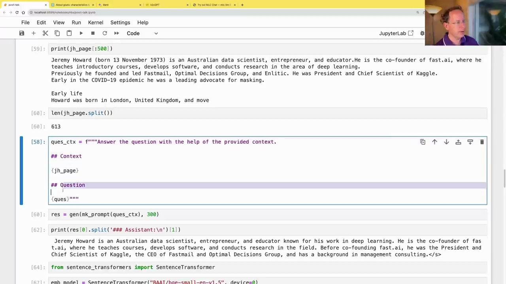

<a href="https://www.youtube.com/watch?v=jkrNMKz9pWU&t=4412s">Link to video</a>


The language model can now generate a response that combines the information from the Wikipedia page with its own language understanding capabilities, resulting in a more accurate and informative answer.


### Evaluating Relevance with Sentence Embeddings


To determine the relevance of a document for a given question, RAG often employs sentence embeddings. These are dense vector representations of text, where similar texts have similar embeddings.


```python

from sentence_transformers import SentenceTransformer


emb_model = SentenceTransformer("BAAT/bge-small-en-v1.5", device=0)


jh = jh_page.split('\n\n')[0]

print(jh)


tb_page = wiki.page('Tony_Blair').text.split('\n\nReferences\n')[0]


tb = tb_page.split('\n\n')[0]

print(tb[:380])


q_emb, jh_emb, tb_emb = emb_model.encode([ques, jh, tb], convert_to_tensor=True)


F.cosine_similarity(q_emb, jh_emb, dim=0)

F.cosine_similarity(q_emb, tb_emb, dim=0)

```


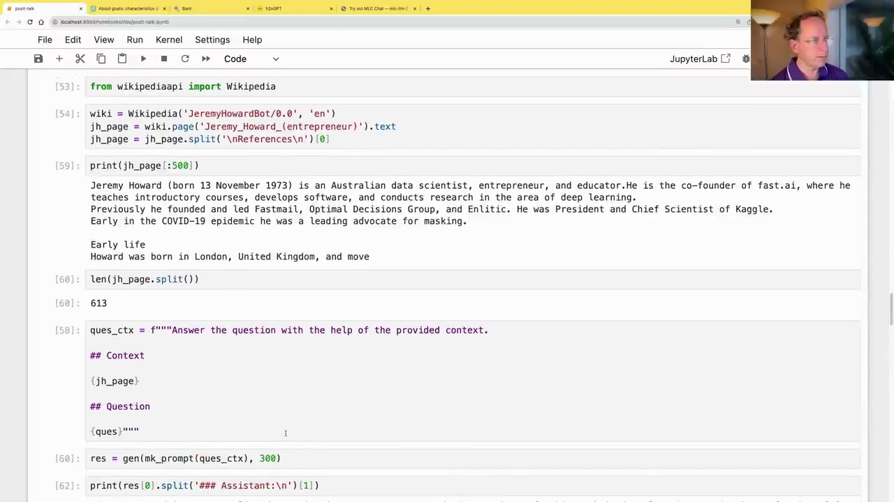

<a href="https://www.youtube.com/watch?v=jkrNMKz9pWU&t=4532s">Link to video</a>


By calculating the cosine similarity between the question embedding and the document embeddings, we can identify the most relevant document for answering the question.


Retrieval Augmented Generation is a powerful technique that combines the strengths of retrieval systems and language models, enabling more accurate and informative responses to queries by leveraging external knowledge sources.
## [10 Fine-Tuning Models](https://www.youtube.com/watch?v=jkrNMKz9pWU&t=4808s)


### Private GPTs and Fine-tuning


There are numerous private GPT models available, as listed and compared on the H2O GPT webpage. These models offer options like retrieval-augmented generation. However, the most interesting approach is to perform our own fine-tuning, where we can adapt the model's behavior based on the available documents.


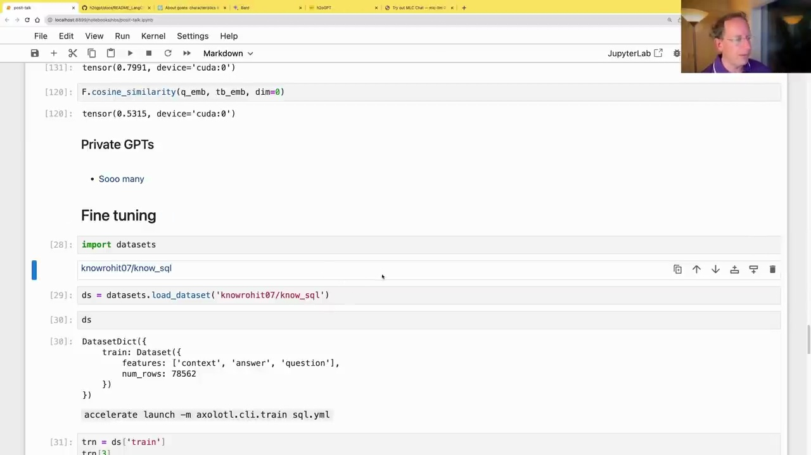

<a href="https://www.youtube.com/watch?v=jkrNMKz9pWU&t=4928s">Link to video</a>


### Fine-tuning with SQL Dataset


In this example, we'll fine-tune a model using the `knowrohit07/know_sql` dataset from Hugging Face. This dataset contains examples of database table schemas, questions in natural language, and the corresponding SQL queries to answer those questions.


The goal is to create a tool that can generate SQL queries automatically from English questions, potentially useful for business users.


```python

import datasets


knowrohit07/know_sql


ds = datasets.load_dataset('knowrohit07/know_sql')

ds

```


The dataset consists of a training set with features like 'context' (table schema), 'answer' (SQL query), and 'question' (natural language query).


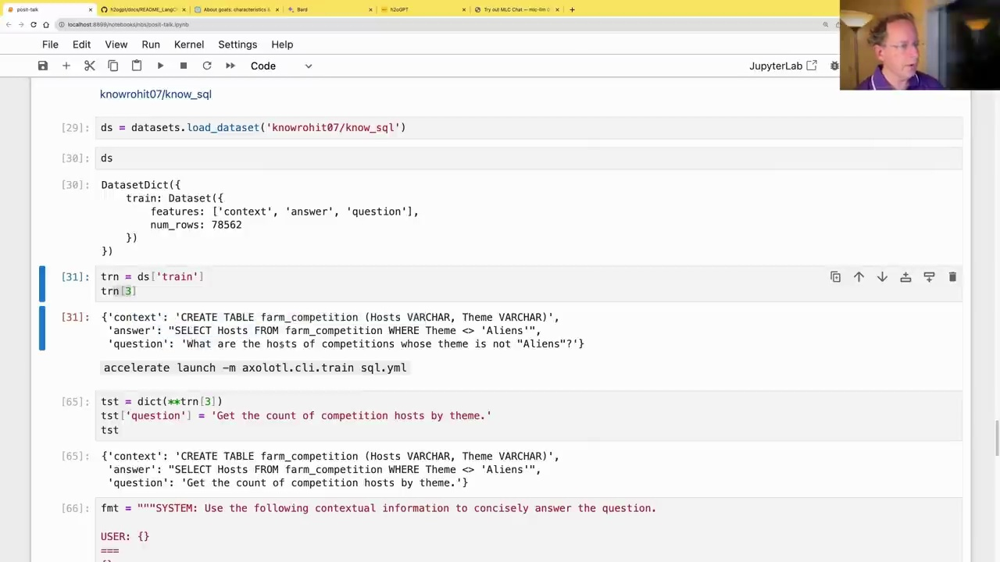

<a href="https://www.youtube.com/watch?v=jkrNMKz9pWU&t=4988s">Link to video</a>


To fine-tune the model, we'll use the Axolotl library, which provides a convenient interface for fine-tuning with various models and configurations.


```

accelerate launch -m axolotl.cli.train sql.yml

```


This command fine-tunes the model using the specified configuration file (`sql.yml`) and saves the quantized model in the `qlora-out` directory.


### Testing the Fine-tuned Model


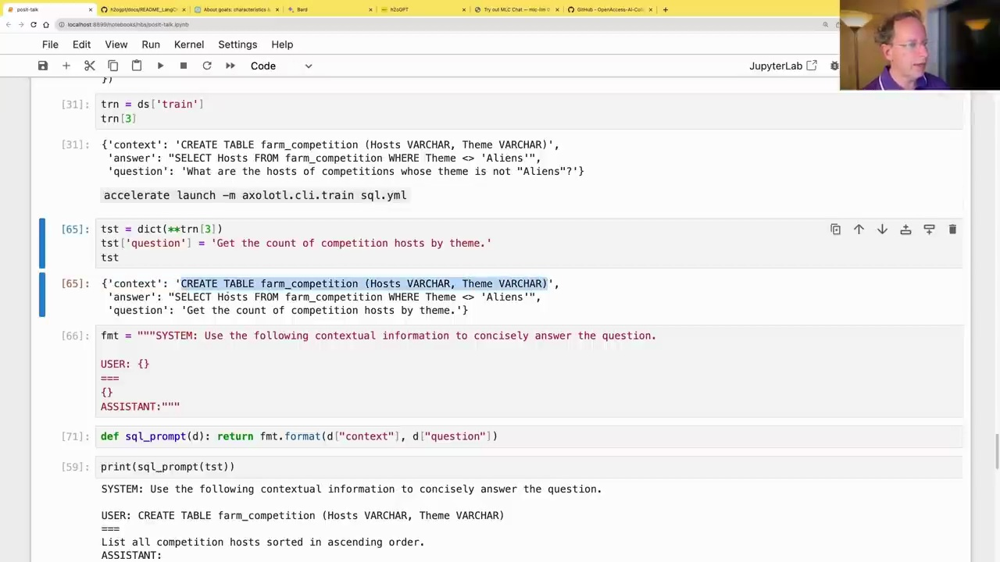

<a href="https://www.youtube.com/watch?v=jkrNMKz9pWU&t=5108s">Link to video</a>


After fine-tuning, we can test the model by providing a context (table schema) and a question in natural language. The model should generate the corresponding SQL query.


```python

def sql_prompt(d): return fmt.format(d["context"], d["question"])


print(sql_prompt(tst))

```


```

SYSTEM: Use the following contextual information to concisely answer the question.


USER: CREATE TABLE farm_competition (Hosts VARCHAR, Theme VARCHAR)

...

List all competition hosts sorted in ascending order.

ASSISTANT: SELECT Hosts FROM farm_competition ORDER BY Hosts ASC;

```


The fine-tuned model successfully generates the correct SQL query to list all competition hosts in ascending order, given the table schema and the natural language question.


Overall, fine-tuning GPT models with domain-specific datasets like SQL queries can potentially enable powerful applications for querying databases using natural language.
## [11 Running Models on Macs](https://www.youtube.com/watch?v=jkrNMKz9pWU&t=5160s)


### MLC LLM: A Universal Solution


MLC LLM is a universal solution that allows any language model to be deployed natively on a diverse set of hardware backends and native applications, plus a productive framework for everyone to further optimize model performance for their own use cases. Everything runs locally with no server support and accelerated with local GPUs on your phone and laptop.


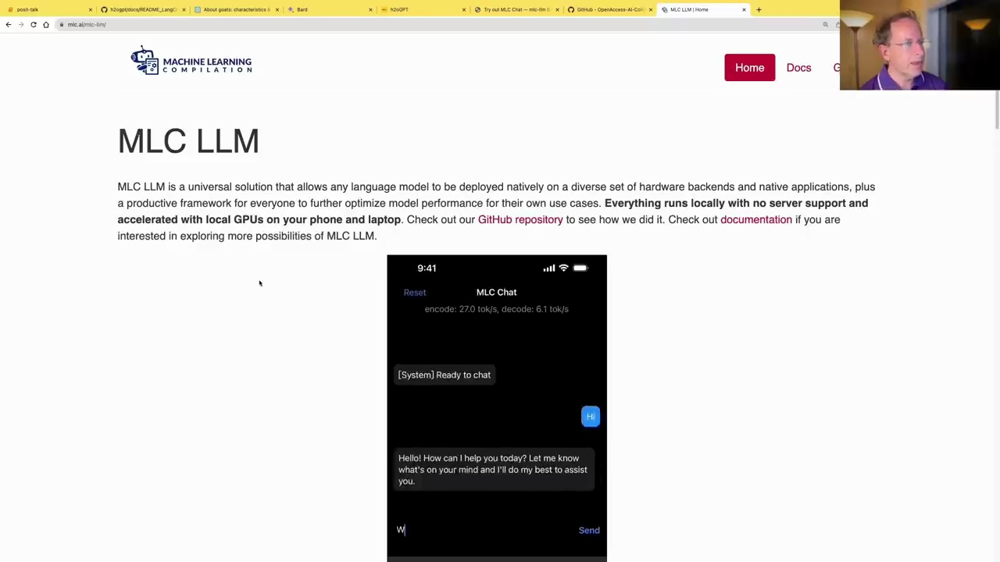

<a href="https://www.youtube.com/watch?v=jkrNMKz9pWU&t=5220s">Link to video</a>


MLC LLM provides a way to run language models on mobile devices like iPhones and Android phones, as well as web browsers. It's a really cool project that is underappreciated.


### Running a Language Model on a Mac


On a Mac, you can use MLC or llama.cpp to run language models. Here's an example of running a 7B language model on a Mac using a Python script:


```python

from llama_cpp import Llama


llm = Llama(model_path="/home/jhoward/git/llamacpp/llama-2-7b-chat.04_K.M.gguf")

```


This loads a 7B language model from the specified path. You can then use the model to generate text or answer questions.


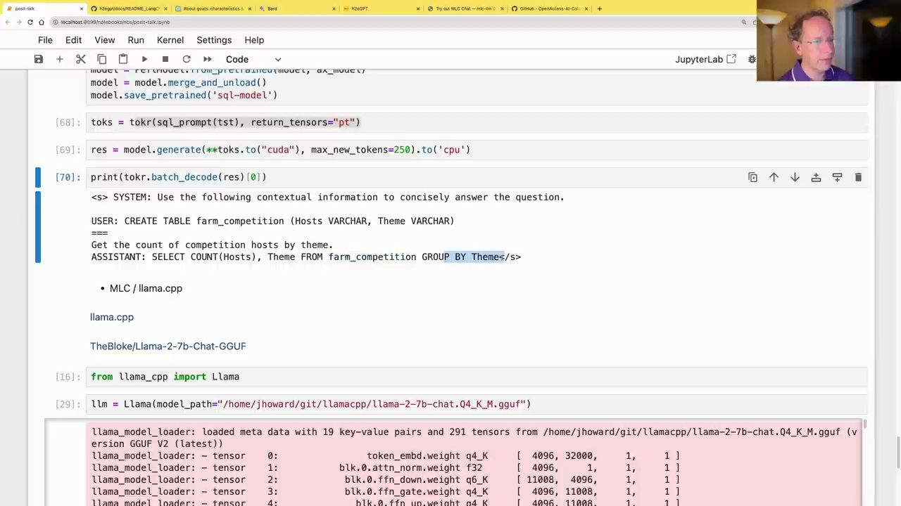

<a href="https://www.youtube.com/watch?v=jkrNMKz9pWU&t=5160s">Link to video</a>


```python

res = model.generate(**toks.to("cuda"), max_new_tokens=250).to('cpu')

print(tokr.batch_decode(res)[0])

```


This generates a response from the language model based on the given input tokens, using the GPU for acceleration. The output is then printed.


### Example: Asking the Meaning of Life


With the language model loaded, you can ask it questions like "What is the meaning of life?". The model will generate a response based on its training data and knowledge.


Overall, MLC LLM provides a powerful way to run large language models on local devices, enabling new applications and use cases for natural language processing.